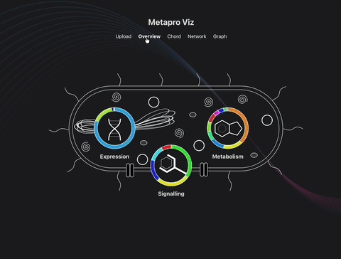

# Metapro Viz for Metatranscriptomics data visualization

*This tool is not published yet. Documentation pretains to development version*

Metapro Viz can be read mapped RPKM data generated by Metapro to generate three types of visualizations: Chord, Network, and Graph.



## Usage

Metapro Viz is provided as an installable executable. Please run the executable to install and then run.


## Development

### Install

```bash
$ npm install
```

### Dev server

```bash
$ npm start
```

### Database

When released, the installer will fetch the supporting databases from our server.
It is also possible to create the database from scratch by running the following notebooks in order, under `resources/scripts`
```
make_tax_hierarchy_database_source.ipynb
write_to_tax_db.ipynb
make_superpathway_db.ipynb
get_kegg_pathways.ipynb
make_pathway_db.ipynb
```
For each, run all cells in the notebook once. This will generate `resources/db/taxonomy.db` and populate it with data.
In the future they may be combined into a single script.