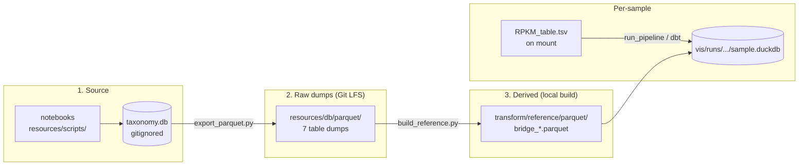

# Metapro Viz for Metatranscriptomics data visualization

*This tool is not published yet. Documentation pertains to development version.*

Metapro Viz is a downstream data visualization tool for [MetaPro](https://github.com/ParkinsonLab/MetaPro). Point it at MetaPro output on disk, choose an `RPKM_table.tsv`, and explore the results in Chord, Network, Graph, Overview, and Krona views.


## Usage

Metapro Viz is a web application. Mount your MetaPro output folder, open the app, and use the **Data** tab to choose which `RPKM_table.tsv` to work with. The app **processes** that file for visualization (first time can take several minutes on large tables), then serves the interactive views.

### Run the application

A hosted container image is planned as the primary distribution. **Not published yet** — until then, build and run from source; see [Building the container image](#building-the-container-image) under [Contributing](#contributing) (same steps work for early adopters).

When the image is available:

```bash
docker pull <registry>/metapro-viz:<tag>   # coming soon
docker run -p 8080:8080 \
  -v /path/to/metapro/output:/data \
  <registry>/metapro-viz:<tag>
```

Open [http://localhost:8080](http://localhost:8080).

On macOS, if Docker cannot access your data folder, add it under **Docker Desktop → Settings → Resources → File sharing**.

### Mount your MetaPro output

Mount the folder that **contains** your MetaPro analysis directories at `/data` inside the container.

- The app scans that tree for files named `RPKM_table.tsv` and lists each one as a separate dataset in the **Data** tab.
- Folders under `vis/` are ignored (processed results written by the app).
- Each MetaPro analysis (for example `mouse1_run/`) normally produces one `RPKM_table.tsv`, usually at `outputs/final_results/RPKM_table.tsv`.
- Other files in the tree (configs, assemblies, annotation tables, etc.) are not used for visualization.

Example layout — [MetaPro mouse tutorial release 1.0](https://github.com/ParkinsonLab/MetaPro_tutorial/releases/tag/1.0) matches a typical MetaPro output tree:

```
/path/to/metapro/output/
  mouse1_run/
    outputs/final_results/RPKM_table.tsv   ← one dataset
    assemble_contigs/…
    taxonomic_annotation/…
    …
  mouse2_run/
    outputs/final_results/RPKM_table.tsv   ← another dataset
  databases/                               ← no RPKM_table.tsv; ignored
```


| `RPKM_table.tsv` location (under mount)           | Name in Data tab                     | Path column                                                                                    |
| ------------------------------------------------- | ------------------------------------ | ---------------------------------------------------------------------------------------------- |
| `mouse1_run/outputs/final_results/RPKM_table.tsv` | `mouse1_run__outputs__final_results` | Full path to the file (e.g. `/data/mouse1_run/outputs/final_results/RPKM_table.tsv` in Docker) |


- **Data tab name:** path to the TSV’s parent folder, relative to `/data`, with `/` replaced by `__`. A file at the mount root would appear as `_root`.
- **Status values:** **Not processed**, **Ready**, **Needs reprocessing** (source file changed), **Processing**, **Failed**.
- **RPKM format:** tax columns must be numeric NCBI tax ids (after `GeneID`, `Length`, `Reads`, `EC#`, `RPKM`). Current MetaPro output uses this format. The [tutorial release 1.0](https://github.com/ParkinsonLab/MetaPro_tutorial/releases/tag/1.0) file uses older scientific-name headers — see [docs/metapro-mouse-tutorial-rpkm.md](docs/metapro-mouse-tutorial-rpkm.md) for the one-time header fix.

### Select a dataset and explore

1. Open the **Data** tab. Each row is one discovered `RPKM_table.tsv`.
2. Click a dataset. The app **processes it for visualization** and shows progress. When processing finishes, that dataset becomes active for the views.
3. Use **Overview**, **Chord**, **Network**, **Graph**, and **Krona** to explore the active dataset.
4. **Refresh** rescans the mount for new or moved `RPKM_table.tsv` files.

Processed results are written next to your data under `vis/` (for example `vis/runs/mouse1_run__outputs__final_results/`). The app reuses them on later visits unless the source `RPKM_table.tsv` changed.

**To process again** after updating a source file: delete that dataset’s folder under `vis/` (or the whole `vis/` tree), then select the dataset in **Data** again.

### Configuration

Optional environment variables (container defaults):


| Variable    | Default          | Purpose                                   |
| ----------- | ---------------- | ----------------------------------------- |
| `DATA_ROOT` | `/data`          | MetaPro output mount inside the container |
| `RUNS_DIR`  | `/data/vis/runs` | Where processed results are stored        |


### Troubleshooting


| Problem                            | Things to check                                                                                                                           |
| ---------------------------------- | ----------------------------------------------------------------------------------------------------------------------------------------- |
| No datasets in **Data**            | Mount path includes your analysis folders; `RPKM_table.tsv` exists under the mount; the file is not under `vis/` (processed results only) |
| Error when selecting a dataset     | Empty or invalid TSV; tutorial file still has scientific-name headers ([fix](docs/metapro-mouse-tutorial-rpkm.md))                        |
| **Upload** tab instead of **Data** | Pre-release image built without FastAPI + dbt mode, or stale browser data for `localhost:8080`                                            |
| Docker cannot read files on macOS  | Add the host folder under Docker Desktop file sharing                                                                                     |


## Contributing

Sections below share a common [Prerequisites](#prerequisites) setup. Typical day-to-day work is [Development](#development); [Building the container image](#building-the-container-image) and [Refreshing reference data](#refreshing-reference-data) are less frequent maintainer tasks.

### Prerequisites

**1. System tools**

| Tool | Version | Used for |
| --- | --- | --- |
| [Git](https://git-scm.com/) | recent | clone, worktrees |
| [Git LFS](https://git-lfs.com/) | recent | raw reference Parquet, test fixtures |
| [Node.js](https://nodejs.org/) | see [`.nvmrc`](.nvmrc) | frontend, Express legacy, `npm` scripts |
| [Python](https://www.python.org/) | see [`.python-version`](.python-version) | FastAPI, dbt, pytest, reference scripts |
| [uv](https://docs.astral.sh/uv/) | recent | Python env (`analytics/`) |
| [Docker](https://www.docker.com/) | recent | [container builds](#building-the-container-image) only |

One-time Git LFS setup:

```bash
brew install git-lfs   # or your package manager
git lfs install
```

**2. Clone and fetch LFS data**

```bash
git clone git@github.com:ParkinsonLab/metapro-data-vis.git
cd metapro-data-vis
git lfs pull
```

When you `git pull` and the update includes changes to LFS-tracked paths (see below), run `git lfs pull` too — otherwise files such as `resources/db/parquet/*.parquet` may be small pointer stubs instead of real data.

```bash
git pull
git lfs pull
```

LFS-tracked paths (see `.gitattributes`):

- `resources/db/parquet/*.parquet` — raw reference table dumps
- `resources/example_data/test_rpkm_*.tsv` — sample RPKM inputs for tests

`taxonomy.db` is **not** in git or LFS. Normal dev uses committed raw Parquet plus a local `build_reference.py` run.

**3. Project dependencies**

From the repo root:

```bash
npm install                 # Node packages
cd analytics && uv sync     # Python packages (FastAPI, dbt, pytest, reference scripts)
```

For [refreshing reference data](#refreshing-reference-data) or exploratory notebooks, install the extra Python groups as well:

```bash
cd analytics && uv sync --all-groups   # adds Jupyter, jupysql
```

### Development

Product stack: **FastAPI + dbt** (**Data** tab, mounted `RPKM_table.tsv` on disk).

The legacy Express + browser-upload stack is kept for comparison and migration only — see [docs/legacy-express-upload-development.md](docs/legacy-express-upload-development.md).

Assumes [Prerequisites](#prerequisites).

**Local setup (FastAPI + dbt)**

1. **Build bridge Parquet** (once per clone, or after raw Parquet refresh)

   ```bash
   cd analytics && uv run python transform/scripts/build_reference.py
   ```

   Writes `analytics/transform/reference/parquet/bridge_ec_pathway.parquet` and `bridge_tax_lineage.parquet`. FastAPI fails at startup if these are missing.

2. **Start the app**

   ```bash
   npm run dev          # FastAPI (:8080) + Vite (:5173)
   ```

   Open [http://localhost:5173](http://localhost:5173). Processed results go under `local-data/vis/runs/`.

   **Or** run frontend and backend separately (not together with `npm run dev`):

   ```bash
   npm run dev:fastapi                              # FastAPI only (:8080)
   VITE_DATA_MODE=mounted npm run dev:web           # Vite only (:5173)
   ```

3. **Provide sample data** — pick one:

   - **Quick fixture** (synthetic):

     ```bash
     mkdir -p local-data/tutorial
     cp analytics/transform/tests/fixtures/fake_rpkm.tsv local-data/tutorial/RPKM_table.tsv
     ```

     Select dataset `tutorial` in the **Data** tab.

   - **MetaPro tutorial tree** — symlink the **unzipped tutorial folder** (parent of `mouse1_run/`, not `mouse1_run` itself):

     ```bash
     ln -sf /path/to/MetaPro_tutorial_unzipped local-data
     ```

     Same mount rules as [Mount your MetaPro output](#mount-your-metapro-output). If you use [tutorial release 1.0](https://github.com/ParkinsonLab/MetaPro_tutorial/releases/tag/1.0) `RPKM_table.tsv`, fix the header row first — [docs/metapro-mouse-tutorial-rpkm.md](docs/metapro-mouse-tutorial-rpkm.md). Select dataset `mouse1_run__outputs__final_results`.

Dataset discovery and processing follow the same rules as [Mount your MetaPro output](#mount-your-metapro-output).

*`{DATA_ROOT}`* defaults to `local-data/` at the repo root (`npm run dev` sets this via `dev:fastapi`).

**Tests**

```bash
cd analytics && uv run pytest
```

Pipeline and dbt details: [analytics/transform/README.md](analytics/transform/README.md).

### Building the container image

Routine step when **releasing application code**. Assumes [Prerequisites](#prerequisites). Raw reference Parquet must already be committed (see [Refreshing reference data](#refreshing-reference-data) when it is not).

```bash
docker build -t metapro-viz .
```

**Smoke test** (mount layout and **Data** tab as in [Usage](#usage)):

```bash
# MetaPro output (parent folder that contains run directories)
docker run -p 8080:8080 \
  -v /path/to/metapro/output:/data \
  metapro-viz

# Or local-data/ after [Development](#development) local setup
docker run -p 8080:8080 \
  -v "$(pwd)/local-data:/data" \
  metapro-viz
```

Open [http://localhost:8080](http://localhost:8080).

**What the image bakes in** (`.dockerignore` excludes dev-only paths; build runs `build_reference.py` on raw Parquet):

| Layer | Baked into image |
| --- | --- |
| `taxonomy.db` | No |
| Raw Parquet | Partial — pathway layout files only (`pathway_*`) |
| Bridge Parquet | Yes |
| `sample.duckdb` | No (created on mount at runtime) |

**Publishing:** tag and push to the registry when cutting a release (`docker pull` in Usage will point at that image).

### Refreshing reference data

Infrequent maintainer workflow — **not** part of routine [Development](#development) or [container builds](#building-the-container-image). Reference tables come from external providers (NCBI taxonomy, pathway databases, etc.) that can change schema, coverage, or semantics without notice.

Assumes [Prerequisites](#prerequisites).

#### Reference data

Viz needs reference taxonomy and pathway tables that are **not** part of your MetaPro mount. The FastAPI + dbt stack also writes per-sample DuckDB on the mount when you process a dataset:


```mermaid
flowchart LR
  subgraph source["1. Source"]
    NB["notebooks<br/>resources/scripts/"]
    TDB[("taxonomy.db<br/>gitignored")]
    NB --> TDB
  end

  subgraph raw["2. Raw dumps (Git LFS)"]
  TDB -->|"export_parquet.py"| RAW["resources/db/parquet/<br/>7 table dumps"]
  end

  subgraph derived["3. Derived (local build)"]
  RAW -->|"build_reference.py"| BR["transform/reference/parquet/<br/>bridge_*.parquet"]
  end

  subgraph sample["Per-sample"]
  RPKM["RPKM_table.tsv<br/>on mount"] -->|"run_pipeline / dbt"| DUCK[("vis/runs/.../sample.duckdb")]
  BR --> DUCK
  end
```

| Layer | Description | Location | Committed? | Used by |
| --- | --- | --- | --- | --- |
| `taxonomy.db` | SQLite built from notebooks; source of truth | `resources/db/` | No | Export only |
| Raw Parquet | Table dumps from taxonomy DB | `resources/db/parquet/` | Yes (Git LFS) | Bridge build; Network layout (`pathway_*`) |
| Bridge Parquet | Denormalized joins for dbt | `analytics/transform/reference/parquet/` | No | dbt pipeline; baked into container |
| Per-sample DuckDB | Enriched mart from RPKM + bridges | `{DATA_ROOT}/vis/runs/{id}/` | No | Viz queries at runtime |

#### Workflow

1. **Rebuild `taxonomy.db`** from notebooks under `resources/scripts/` (when upstream reference data changes).

2. **Export raw Parquet** to `resources/db/parquet/`:

   ```bash
   cd analytics && uv run python exploration/scripts/export_parquet.py
   ```

3. **Validate** — run the exploratory analysis notebook and check results against expected behavior:
   - [analytics/exploration/README.md](analytics/exploration/README.md) (notebook workflow)
   - [analytics/exploration/docs/data-model.md](analytics/exploration/docs/data-model.md) (regression targets)

   ```bash
   cd analytics
   uv run jupyter execute exploration/notebooks/exploratory_analysis.ipynb
   ```

4. **Rebuild bridge Parquet** and run tests:

   ```bash
   cd analytics && uv run python transform/scripts/build_reference.py
   cd analytics && uv run pytest
   ```

5. **Commit** updated `resources/db/parquet/*.parquet` (Git LFS) and any notebook or code changes.

6. **Release** — [build the container image](#building-the-container-image) when ready to ship the new reference data.
