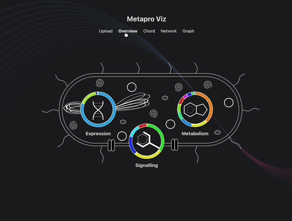

# Metapro Viz for Metatranscriptomics data visualization

*This tool is not published yet. Documentation pertains to development version.*

Metapro Viz is a downstream data visualization tool for [MetaPro](https://github.com/ParkinsonLab/MetaPro). Point it at MetaPro output on disk, choose an `RPKM_table.tsv`, and explore the results in Chord, Network, Graph, Overview, and Krona views.



## Usage

Metapro Viz is a web application. Mount your MetaPro output folder, open the app, and use the **Data** tab to choose which `RPKM_table.tsv` to work with. The app **processes** that file for visualization (first time can take several minutes on large tables), then serves the interactive views.

### Run the application

A hosted container image is planned as the primary distribution. **Not published yet** — use [Building the Docker image](#building-the-docker-image) below if you need to run it before then.

When the image is available:

```bash
docker pull <registry>/metapro-viz:<tag>   # coming soon
docker run -p 8080:8080 \
  -v /path/to/metapro/output:/data \
  <registry>/metapro-viz:<tag>
```

Open http://localhost:8080.

On macOS, if Docker cannot access your data folder, add it under **Docker Desktop → Settings → Resources → File sharing**.

### Mount your MetaPro output

Mount the folder that **contains** your MetaPro analysis directories at `/data` inside the container. The app scans that tree for files named `RPKM_table.tsv` and lists each one as a separate dataset in the **Data** tab. Folders under `vis/` are ignored (that is where the app stores its own processed results).

Each MetaPro analysis (for example `mouse1_run/`) normally produces one `RPKM_table.tsv`, usually at `outputs/final_results/RPKM_table.tsv`. If you mount several analyses, you will see several datasets. Other files in the tree (configs, assemblies, annotation tables, etc.) are not used for visualization.

Example layout — [MetaPro mouse tutorial release 1.0](https://github.com/ParkinsonLab/MetaPro_tutorial/releases/tag/1.0) matches a typical MetaPro output tree:

```
/path/to/metapro/output/
  mouse1_run/
    outputs/final_results/RPKM_table.tsv   ← one dataset
    assemble_contigs/…
    taxonomic_annotation/…
    …
  mouse2_run/
    outputs/final_results/RPKM_table.tsv   ← another dataset
  databases/                               ← no RPKM_table.tsv; ignored
```

| `RPKM_table.tsv` location (under mount) | Name in Data tab |
|---|---|
| `mouse1_run/outputs/final_results/RPKM_table.tsv` | `mouse1_run__outputs__final_results` |

The name in the **Data** tab is the path to the TSV’s parent folder, relative to `/data`, with `/` replaced by `__`. A file at the mount root would appear as `_root`.

**RPKM format:** tax columns must be numeric NCBI tax ids (after the fixed columns `GeneID`, `Length`, `Reads`, `EC#`, `RPKM`). Current MetaPro output uses this format. The [tutorial release 1.0](https://github.com/ParkinsonLab/MetaPro_tutorial/releases/tag/1.0) file uses older scientific-name headers — see [docs/metapro-mouse-tutorial-rpkm.md](docs/metapro-mouse-tutorial-rpkm.md) for the one-time header fix.

### Select a dataset and explore

1. Open the **Data** tab. Each row is one discovered `RPKM_table.tsv`.
2. Click a dataset. The app **processes it for visualization** and shows progress. When processing finishes, that dataset becomes active for the views.
3. Use **Overview**, **Chord**, **Network**, **Graph**, and **Krona** to explore the active dataset.
4. **Refresh** rescans the mount for new or moved `RPKM_table.tsv` files.

Processed results are written next to your data under `vis/` (for example `vis/runs/mouse1_run__outputs__final_results/`). The app reuses them on later visits so you do not need to process again unless the source `RPKM_table.tsv` changed.

**To process again** after you update a source file, delete that dataset’s folder under `vis/` (or the whole `vis/` tree), then select the dataset in **Data** again.

### Configuration

Optional environment variables (container defaults):

| Variable | Default | Purpose |
|---|---|---|
| `DATA_ROOT` | `/data` | MetaPro output mount inside the container |
| `RUNS_DIR` | `/data/vis/runs` | Where processed results are stored |

### Troubleshooting

| Problem | Things to check |
|---|---|
| No datasets in **Data** | Mount path includes your analysis folders; `RPKM_table.tsv` exists under the mount; path is not only inside `vis/` |
| Error when selecting a dataset | Empty or invalid TSV; tutorial file still has scientific-name headers ([fix](docs/metapro-mouse-tutorial-rpkm.md)) |
| **Upload** tab instead of **Data** | Pre-release image built without mounted mode, or stale browser data for `localhost:8080` |
| Docker cannot read files on macOS | Add the host folder under Docker Desktop file sharing |

## Development

```bash
npm install   # Node 22, see .nvmrc
npm test
npm run build
npm start     # legacy Express production server on :8080 (not used by Docker)
```

Local dev mirrors the container layout under `local-data/` (see **Mounted data** below). Use `npm run dev:mounted` for the same **Data** tab flow as the container, with Vite hot reload on :5173.

### Building the Docker image

Until a hosted image is published, build the container from a clone of [ParkinsonLab/metapro-data-vis](https://github.com/ParkinsonLab/metapro-data-vis):

```bash
git clone git@github.com:ParkinsonLab/metapro-data-vis.git
cd metapro-data-vis
git lfs pull   # required once: resources/db/parquet for the image build
docker build -t metapro-viz .
docker run -p 8080:8080 \
  -v /path/to/metapro/output:/data \
  metapro-viz
```

Reference taxonomy and pathway data are baked into the image at build time from `resources/db/parquet/`. They are not read from the mounted MetaPro output.

**Apple Silicon (M1/M2/M3):** the image build uses TensorFlow native bindings that are x86_64-only in Linux containers. Before building:

1. Install Rosetta 2 if prompted: `softwareupdate --install-rosetta`
2. In **Docker Desktop → Settings → General**, enable:
   - **Use Virtualization framework**
   - **Use Rosetta for x86_64/amd64 emulation on Apple Silicon** (on macOS 14.1+ this may already be on)

Then build and run with the `amd64` platform:

```bash
docker build --platform linux/amd64 -t metapro-viz .
docker run --platform linux/amd64 -p 8080:8080 \
  -v /path/to/metapro/output:/data \
  metapro-viz
```

### Dev modes

| Command | Data UI | API backend | Vite proxy `/api` → |
|---|---|---|---|
| `npm run dev` | Upload (legacy) | Express `:3001` | `localhost:3001` |
| `npm run dev:mounted` | Data panel (mounted) | FastAPI `:8080` | `localhost:8080` |

`npm run dev` starts Express + Vite (legacy upload flow). `npm run dev:mounted` starts FastAPI + Vite with `VITE_DATA_MODE=mounted`, which shows the Data panel and proxies all `/api` traffic to FastAPI — closest match to the Docker image.

You can also run the backends separately:

```bash
npm run dev:api       # Express only (:3001)
npm run dev:fastapi   # FastAPI only (:8080, reads local-data/)
npm run dev:web       # Vite only (:5173)
```

Set `VITE_DATA_MODE=mounted` (or `upload`) when starting `dev:web` to pick the default data mode. The in-app toggle persists the choice in `localStorage`.

### Mounted data (local)

FastAPI discovers `RPKM_table.tsv` files under `DATA_ROOT`. `dev:fastapi` sets `DATA_ROOT=../local-data` relative to `analytics/`. Layout and processing behavior match [Mount your MetaPro output](#mount-your-metapro-output) above; processed results go under `local-data/vis/`.

**Quick fixture** (small synthetic file):

```bash
mkdir -p local-data/tutorial
cp analytics/transform/tests/fixtures/fake_rpkm.tsv local-data/tutorial/RPKM_table.tsv
```

Select dataset `tutorial` in the Data tab.

**MetaPro tutorial tree** (same layout as a Docker mount):

```bash
mkdir -p local-data
cp -R /path/to/mouse1_run local-data/
```

If you use the [tutorial release 1.0](https://github.com/ParkinsonLab/MetaPro_tutorial/releases/tag/1.0) `RPKM_table.tsv`, replace its header row first — see [docs/metapro-mouse-tutorial-rpkm.md](docs/metapro-mouse-tutorial-rpkm.md).

Select dataset `mouse1_run__outputs__final_results`, then run `npm run dev:mounted` and open http://localhost:5173.

### Git LFS

Large data files are tracked with [Git LFS](https://git-lfs.com/) (see `.gitattributes`):

- `resources/db/parquet/*.parquet` — reference table dumps for analytics (required for `docker build`)
- `resources/example_data/test_rpkm_*.tsv` — sample RPKM inputs for local dev and tests

`taxonomy.db` is **not** in LFS (local/gitignored). The Docker image builds reference bridges from the Parquet files at image build time; you do not mount `taxonomy.db` into the container. To regenerate Parquet without LFS blobs, see [analytics/exploration/README.md](analytics/exploration/README.md).

**One-time setup** (per machine):

```bash
brew install git-lfs   # or your package manager
git lfs install
```

**New clone:**

```bash
git clone git@github.com:ParkinsonLab/metapro-data-vis.git
cd metapro-data-vis
git lfs pull
```

**Existing clone** (e.g. repo cloned before LFS was added, or after pulling LFS-tracked changes):

```bash
git pull
git lfs pull
```

### Database

`taxonomy.db` is used for **local development** (legacy Express path and regenerating reference Parquet). It is **not** copied into the Docker image.

When released, the installer will fetch the supporting databases from our server.
It is also possible to create the database from scratch by running the following notebooks in order, under `resources/scripts`
```
make_tax_hierarchy_database_source.ipynb
write_to_tax_db.ipynb
make_superpathway_db.ipynb
get_kegg_pathways.ipynb
make_pathway_db.ipynb
```
For each, run all cells in the notebook once. This will generate `resources/db/taxonomy.db` and populate it with data.
In the future they may be combined into a single script.
