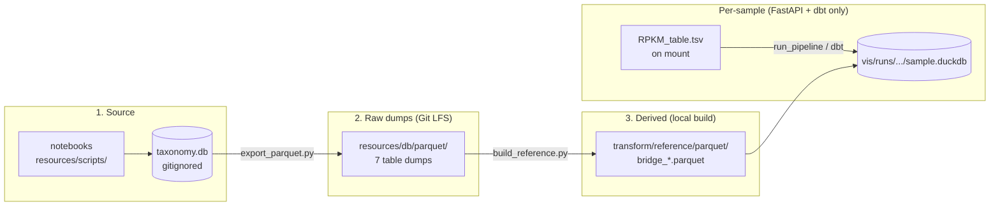

# Metapro Viz for Metatranscriptomics data visualization

*This tool is not published yet. Documentation pertains to development version.*

Metapro Viz is a downstream data visualization tool for [MetaPro](https://github.com/ParkinsonLab/MetaPro). Point it at MetaPro output on disk, choose an `RPKM_table.tsv`, and explore the results in Chord, Network, Graph, Overview, and Krona views.


## Usage

Metapro Viz is a web application. Mount your MetaPro output folder, open the app, and use the **Data** tab to choose which `RPKM_table.tsv` to work with. The app **processes** that file for visualization (first time can take several minutes on large tables), then serves the interactive views.

### Run the application

A hosted container image is planned as the primary distribution. **Not published yet** — until then, build and run from source; see [Building the container image](#building-the-container-image) (maintainer procedure; same steps work for early adopters).

When the image is available:

```bash
docker pull <registry>/metapro-viz:<tag>   # coming soon
docker run -p 8080:8080 \
  -v /path/to/metapro/output:/data \
  <registry>/metapro-viz:<tag>
```

Open [http://localhost:8080](http://localhost:8080).

On macOS, if Docker cannot access your data folder, add it under **Docker Desktop → Settings → Resources → File sharing**.

### Mount your MetaPro output

Mount the folder that **contains** your MetaPro analysis directories at `/data` inside the container. The app scans that tree for files named `RPKM_table.tsv` and lists each one as a separate dataset in the **Data** tab. Folders under `vis/` are ignored (that is where the app stores its own processed results).

Each MetaPro analysis (for example `mouse1_run/`) normally produces one `RPKM_table.tsv`, usually at `outputs/final_results/RPKM_table.tsv`. If you mount several analyses, you will see several datasets. Other files in the tree (configs, assemblies, annotation tables, etc.) are not used for visualization.

Example layout — [MetaPro mouse tutorial release 1.0](https://github.com/ParkinsonLab/MetaPro_tutorial/releases/tag/1.0) matches a typical MetaPro output tree:

```
/path/to/metapro/output/
  mouse1_run/
    outputs/final_results/RPKM_table.tsv   ← one dataset
    assemble_contigs/…
    taxonomic_annotation/…
    …
  mouse2_run/
    outputs/final_results/RPKM_table.tsv   ← another dataset
  databases/                               ← no RPKM_table.tsv; ignored
```


| `RPKM_table.tsv` location (under mount)           | Name in Data tab                     | Path column                                                                                    |
| ------------------------------------------------- | ------------------------------------ | ---------------------------------------------------------------------------------------------- |
| `mouse1_run/outputs/final_results/RPKM_table.tsv` | `mouse1_run__outputs__final_results` | Full path to the file (e.g. `/data/mouse1_run/outputs/final_results/RPKM_table.tsv` in Docker) |


The name in the **Data** tab is the path to the TSV’s parent folder, relative to `/data`, with `/` replaced by `__`. A file at the mount root would appear as `_root`. Status values: **Not processed**, **Ready**, **Needs reprocessing** (when the `RPKM_table.tsv` changed since last processing), **Processing**, **Failed**.

**RPKM format:** tax columns must be numeric NCBI tax ids (after the fixed columns `GeneID`, `Length`, `Reads`, `EC#`, `RPKM`). Current MetaPro output uses this format. The [tutorial release 1.0](https://github.com/ParkinsonLab/MetaPro_tutorial/releases/tag/1.0) file uses older scientific-name headers — see [docs/metapro-mouse-tutorial-rpkm.md](docs/metapro-mouse-tutorial-rpkm.md) for the one-time header fix.

### Select a dataset and explore

1. Open the **Data** tab. Each row is one discovered `RPKM_table.tsv`.
2. Click a dataset. The app **processes it for visualization** and shows progress. When processing finishes, that dataset becomes active for the views.
3. Use **Overview**, **Chord**, **Network**, **Graph**, and **Krona** to explore the active dataset.
4. **Refresh** rescans the mount for new or moved `RPKM_table.tsv` files.

Processed results are written next to your data under `vis/` (for example `vis/runs/mouse1_run__outputs__final_results/`). The app reuses them on later visits so you do not need to process again unless the source `RPKM_table.tsv` changed.

**To process again** after you update a source file, delete that dataset’s folder under `vis/` (or the whole `vis/` tree), then select the dataset in **Data** again.

### Configuration

Optional environment variables (container defaults):


| Variable    | Default          | Purpose                                   |
| ----------- | ---------------- | ----------------------------------------- |
| `DATA_ROOT` | `/data`          | MetaPro output mount inside the container |
| `RUNS_DIR`  | `/data/vis/runs` | Where processed results are stored        |


### Troubleshooting


| Problem                            | Things to check                                                                                                                           |
| ---------------------------------- | ----------------------------------------------------------------------------------------------------------------------------------------- |
| No datasets in **Data**            | Mount path includes your analysis folders; `RPKM_table.tsv` exists under the mount; the file is not under `vis/` (processed results only) |
| Error when selecting a dataset     | Empty or invalid TSV; tutorial file still has scientific-name headers ([fix](docs/metapro-mouse-tutorial-rpkm.md))                        |
| **Upload** tab instead of **Data** | Pre-release image built without FastAPI + dbt mode, or stale browser data for `localhost:8080`                                            |
| Docker cannot read files on macOS  | Add the host folder under Docker Desktop file sharing                                                                                     |


## Development

For **contributors** working on the app locally:


| | **FastAPI + dbt** | **Express + upload** |
| --- | --- | --- |
| Role | Product path | Legacy — comparison and migration |
| UI | **Data** tab — discover `RPKM_table.tsv` on disk | **Upload** tab — browser file upload |
| Backend | FastAPI + dbt pipeline | Express |
| Sample output | `vis/runs/{id}/sample.duckdb` on disk | In-memory / uploaded TSV |

### Prerequisites

```bash
npm install          # Node 22, see .nvmrc
cd analytics && uv sync   # Python 3.14, for FastAPI and pytest
```

Run `git lfs pull` after clone or pull when LFS-tracked files change — see [Git LFS](#git-lfs). Required for reference Parquet and some analytics tests.

### Reference data (`taxonomy.db` and Parquet)

Viz needs reference taxonomy and pathway tables that are **not** part of your MetaPro mount. They form three layers; the FastAPI + dbt stack also writes per-sample DuckDB on the mount when you process a dataset:


```mermaid
flowchart LR
  subgraph source["1. Source"]
    NB["notebooks<br/>resources/scripts/"]
    TDB[("taxonomy.db<br/>gitignored")]
    NB --> TDB
  end

  subgraph raw["2. Raw dumps (Git LFS)"]
  TDB -->|"export_parquet.py"| RAW["resources/db/parquet/<br/>7 table dumps"]
  end

  subgraph derived["3. Derived (local build)"]
  RAW -->|"build_reference.py"| BR["transform/reference/parquet/<br/>bridge_*.parquet"]
  end

  subgraph sample["Per-sample (FastAPI + dbt only)"]
  RPKM["RPKM_table.tsv<br/>on mount"] -->|"run_pipeline / dbt"| DUCK[("vis/runs/.../sample.duckdb")]
  BR --> DUCK
  end
```

| Layer | Description | Runtime location | FastAPI + dbt | Express + upload |
| --- | --- | --- | --- | --- |
| 1 — `taxonomy.db` | SQLite built from notebooks; source of truth | `resources/db/` | Build chain only | Queried directly |
| 2 — raw Parquet | Table dumps (Git LFS) | `resources/db/parquet/` | Bridge build; Network layout (`pathway_*`) | — |
| 3 — bridge Parquet | Denormalized joins for dbt (built locally, not committed) | `transform/reference/parquet/` | dbt pipeline | — |
| Per-sample — `sample.duckdb` | Enriched mart from `RPKM_table.tsv` + bridges | `{DATA_ROOT}/vis/runs/{id}/` | Viz queries | — |

*`{DATA_ROOT}`* defaults to `local-data/` in dev (`dev:fastapi` sets it relative to `analytics/`).

### FastAPI + dbt

**Data** tab, FastAPI on port 8080, Vite hot reload on 5173. Use `local-data/` as the data root.

**Start the app** — pick one workflow:

```bash
npm run dev          # FastAPI + Vite together
```

Open [http://localhost:5173](http://localhost:5173). Processed results go under `local-data/vis/runs/` (`dev:fastapi` sets `DATA_ROOT=../local-data` relative to `analytics/`).

**Or** run frontend and backend separately (not together with `npm run dev`):

```bash
npm run dev:fastapi                              # FastAPI only (:8080)
VITE_DATA_MODE=mounted npm run dev:web           # Vite only (:5173)
```

Dataset discovery and processing follow the same rules as [Mount your MetaPro output](#mount-your-metapro-output).

**Quick fixture** (small synthetic file):

```bash
mkdir -p local-data/tutorial
cp analytics/transform/tests/fixtures/fake_rpkm.tsv local-data/tutorial/RPKM_table.tsv
```

Select dataset `tutorial` in the **Data** tab.

**MetaPro tutorial tree** — point `local-data/` at the **unzipped tutorial folder** (the parent of `mouse1_run/`, not `mouse1_run` itself). Same layout as [Mount your MetaPro output](#mount-your-metapro-output):

```bash
ln -sf /path/to/MetaPro_tutorial_unzipped local-data
```

If you use the [tutorial release 1.0](https://github.com/ParkinsonLab/MetaPro_tutorial/releases/tag/1.0) `RPKM_table.tsv`, fix the header row first — see [docs/metapro-mouse-tutorial-rpkm.md](docs/metapro-mouse-tutorial-rpkm.md). Select dataset `mouse1_run__outputs__final_results` in **Data**.

**Analytics / transform:**

```bash
cd analytics && uv run pytest
```

Pipeline and dbt details: [analytics/transform/README.md](analytics/transform/README.md).

### Express + upload (legacy)

Original Express + browser upload stack. Does **not** match the FastAPI + dbt path.

**Start the app** — pick one workflow:

```bash
npm run dev:legacy    # Express + Vite together, Upload tab
```

**Or** run frontend and backend separately (not together with `npm run dev:legacy`):

```bash
npm run dev:api       # Express only
npm run dev:web       # Vite only; default upload mode unless VITE_DATA_MODE=upload
```

```bash
npm test              # vitest (Node handlers)
npm run build && npm start   # legacy Express production build on :8080
```

Set `VITE_DATA_MODE=upload` when starting `dev:web` to default to the Upload tab. The in-app toggle persists the choice in `localStorage`.

Express reads `taxonomy.db` directly for taxonomy and pathway layout — see [Reference data](#reference-data-taxonomydb-and-parquet). Build it locally with the notebooks under `resources/scripts/` ([analytics/exploration/README.md](analytics/exploration/README.md)).

### Git LFS

Large data files are tracked with [Git LFS](https://git-lfs.com/) (see `.gitattributes`):

- `resources/db/parquet/*.parquet` — raw reference table dumps (see [Reference data](#reference-data-taxonomydb-and-parquet))
- `resources/example_data/test_rpkm_*.tsv` — sample RPKM inputs for tests

`taxonomy.db` is **not** in LFS (build it locally or use committed Parquet). See [Reference data](#reference-data-taxonomydb-and-parquet).

**One-time setup** (per machine):

```bash
brew install git-lfs   # or your package manager
git lfs install
```

**New clone:**

```bash
git clone git@github.com:ParkinsonLab/metapro-data-vis.git
cd metapro-data-vis
git lfs pull
```

**Existing clone** (e.g. after pulling LFS-tracked changes):

```bash
git pull
git lfs pull
```

## Building the container image

Build, smoke-test, and publish the distribution image. Until an image is on Docker Hub, early adopters can follow the same steps (linked from [Run the application](#run-the-application) in Usage).

**Prerequisites:** clone this repo and run `git lfs pull` so `resources/db/parquet/` is present — see [Git LFS](#git-lfs).

```bash
git clone git@github.com:ParkinsonLab/metapro-data-vis.git
cd metapro-data-vis
git lfs pull
docker build -t metapro-viz .
```

Run the image (mount layout and **Data** tab as in [Usage](#usage)):

```bash
# Your MetaPro output (parent folder that contains run directories)
docker run -p 8080:8080 \
  -v /path/to/metapro/output:/data \
  metapro-viz

# Or smoke test with local-data/ after preparing it in [FastAPI + dbt](#fastapi--dbt)
docker run -p 8080:8080 \
  -v "$(pwd)/local-data:/data" \
  metapro-viz
```

Open [http://localhost:8080](http://localhost:8080).

`.dockerignore` excludes `local-data/`, dbt artifacts (`transform/logs`, `target`, `runs`), and other dev-only paths from the build context. The build runs `build_reference.py` on `resources/db/parquet/` and bakes reference data into the image:

| Layer | Baked into image |
| --- | --- |
| `taxonomy.db` | No |
| Raw Parquet | Partial — pathway layout files only (`pathway_*`) |
| Bridge Parquet | Yes |
| `sample.duckdb` | No (created on mount at runtime) |

To ship updated reference tables, rebuild `taxonomy.db`, run `export_parquet.py`, commit LFS Parquet, then rebuild the image. Layer descriptions and stack usage: [Reference data](#reference-data-taxonomydb-and-parquet); export workflow: [analytics/exploration/README.md](analytics/exploration/README.md).

**Apple Silicon (M1/M2/M3):** the image build uses TensorFlow native bindings that are x86_64-only in Linux containers. Before building:

1. Install Rosetta 2 if prompted: `softwareupdate --install-rosetta`
2. In **Docker Desktop → Settings → General**, enable:
  - **Use Virtualization framework**
  - **Use Rosetta for x86_64/amd64 emulation on Apple Silicon** (on macOS 14.1+ this may already be on)

Then build and run with the `amd64` platform:

```bash
docker build --platform linux/amd64 -t metapro-viz .
docker run --platform linux/amd64 -p 8080:8080 \
  -v /path/to/metapro/output:/data \
  metapro-viz
```

**Publishing:** tag and push to the registry when cutting a release (`docker pull` in Usage will point at that image).

