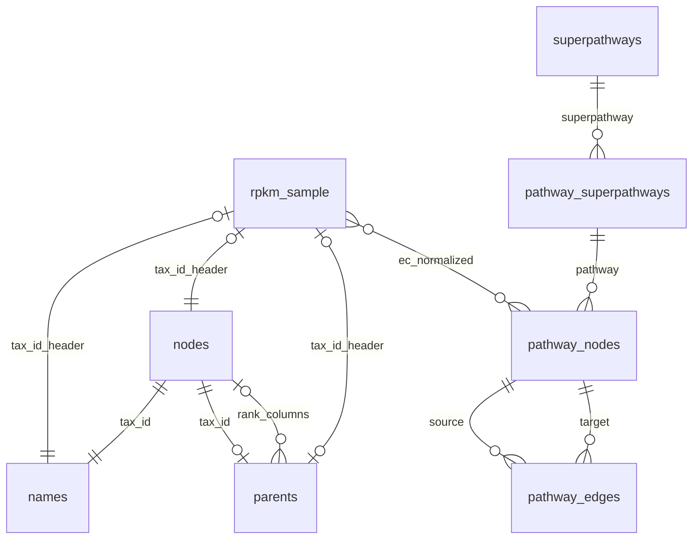

# Data Model

> Generated from exploratory analysis. Factual claims match stored notebook outputs in `analytics/exploration/notebooks/exploratory_analysis.ipynb`.

This document has two layers:

1. **As-found facts** — table schemas, row counts, RPKM shape (sections below through RPKM Wide Format).
2. **Intended logical model (observed-grounded)** — [Logical ER Diagram](#logical-er-diagram-observed-grounded), edge evidence (with review flags), and regression validation targets. Cardinalities describe how relationships **should** hold; each edge cites notebook measurements. Use the **Review flag** column for open review items — there is no separate discrepancies section.

**Join convention:** Taxonomy joins use `tax_id`, not `names.id` (`names.id` is a UUID surrogate primary key from `write_to_tax_db.ipynb`).

## Reference Tables

Parquet reference tables are exported from SQLite and loaded by the notebook as DuckDB views.

| Table | Rows | Columns |
|---|---:|---|
| `names` | 2,840,139 | `id VARCHAR`, `tax_id BIGINT`, `name VARCHAR` |
| `nodes` | 2,840,139 | `id BIGINT` |
| `parents` | 2,840,134 | `id VARCHAR`, `tax_id BIGINT`, `t_kingdom BIGINT`, `t_phylum BIGINT`, `t_class BIGINT`, `t_order BIGINT`, `t_family BIGINT`, `t_genus BIGINT`, `t_species BIGINT` |
| `pathway_nodes` | 23,864 | `id VARCHAR`, `name VARCHAR`, `type VARCHAR`, `x BIGINT`, `y BIGINT`, `pathway BIGINT` |
| `pathway_edges` | 46,726 | `id VARCHAR`, `source VARCHAR`, `target VARCHAR`, `pathway BIGINT` |
| `pathway_superpathways` | 193 | `id BIGINT`, `name VARCHAR`, `superpathway VARCHAR` |
| `superpathways` | 13 | `id VARCHAR`, `name VARCHAR` |

Key fields used by the app and EDA:

| Relationship | Key usage | Observed notebook result |
|---|---|---|
| `names.tax_id -> nodes.id` | Taxonomy name lookup | 0 orphan rows in the checked join (§6) |
| `parents.t_kingdom` … `t_species -> nodes.id` | Taxonomic rank lookup (all rank columns) | 0 orphan rows per rank column in §6 orphan-FK UNION |
| `pathway_edges.source -> pathway_nodes.id` | Pathway graph source node | 0 orphan rows in the checked join (§6) |
| `pathway_edges.target -> pathway_nodes.id` | Pathway graph target node | 0 orphan rows in the checked join (§6) |
| `pathway_superpathways.superpathway -> superpathways.id` | Superpathway lookup | 0 orphan rows in the checked join (§6) |
| `pathway_nodes.pathway -> pathway_superpathways.id` | Logical app join, not declared as SQLite FK | Missing-link query returned 0 rows (`LIMIT 20`; not exhaustive) (§7) |

Additional cardinality checks (detail also in [Edge evidence](#edge-evidence)):

- `names` has exactly 1 row per `tax_id` in this dump: min 1, max 1, median 1.0, average 1.0 (§4).
- `parents` has 2,840,134 rows; 0 duplicate `tax_id` values (§6); exactly 5 nodes have no `parents` row — the meta/root allowlist below (§6; 0 unexpected parentless nodes).
- **Meta/root allowlist (no `parents` row permitted outside this set):**

| tax_id | scientific_name |
|---:|---|
| 1 | root |
| 10239 | Viruses |
| 131567 | cellular organisms |
| 2787823 | unclassified entries |
| 2787854 | other entries |

- Rank ladder completeness (§6): 0 `species_missing_upstream`, 0 `genus_missing_upstream`, 0 `family_missing_upstream`, 0 `order_missing_upstream`, 0 `class_missing_upstream`, 0 `phylum_missing_upstream`, 0 `kingdom_with_finer_but_missing_phylum` (2,840,134 `parents` rows checked).
- Rank transitive consistency (§6): 0 `genus_snapshot_mismatches`, 0 `family_snapshot_mismatches`, 0 `order_snapshot_mismatches`, 0 `class_snapshot_mismatches`, 0 `phylum_snapshot_mismatches`.
- Pathway graph degree is sparse and skewed: out-degree min 0, max 945, median 0.0; in-degree min 0, max 945, median 0.0 (§4).
- Pathway edge counts per pathway range from 2 to 2,410, with median 132.0 (§4).
- Displayed dangling-node output is led by pathway 1100 with 3,716 dangling nodes, pathway 1110 with 2,480, and pathway 1120 with 1,208 (§6).

## RPKM Wide Format

Both sample files are wide TSVs. The fixed columns are:

`GeneID`, `Length`, `Reads`, `EC#`, `RPKM`, `Unclassified`

Every remaining column header is interpreted as a taxonomy `tax_id`. Cross-domain taxonomy joins are evaluated per tax_id column header, not per RPKM row.

| File | Rows | Tax_id columns | Size reported by notebook |
|---|---:|---:|---:|
| `test_rpkm_1.tsv` | 425,828 | 8 | 51.0 MB |
| `test_rpkm_2.tsv` | 461,112 | 12 | 71.1 MB |

Tax_id column overlap:

- `test_rpkm_1.tsv`: 8 tax_id columns.
- `test_rpkm_2.tsv`: 12 tax_id columns.
- Intersection: 6 tax_id columns.
- Only in `test_rpkm_1.tsv`: 2 tax_id columns.
- Only in `test_rpkm_2.tsv`: 6 tax_id columns.

RPKM sparsity was measured for `test_rpkm_1.tsv`: 3,406,624 tax_id cells, 59,439 nonzero cells, 1.74% nonzero.

EC normalization used for joins:

- Null, empty, `None`, `none`, `NA`, and `null` values normalize to `0.0.0.0`.
- `EC:x.y.z` values normalize to `x.y.z`.
- Existing non-prefixed values are preserved as strings.

The most common normalized EC output displayed for `test_rpkm_1.tsv` is `None -> 0.0.0.0` with 235,991 rows. The displayed top EC-prefixed row is `EC:2.7.13.3 -> 2.7.13.3` with 8,513 rows.

## Logical ER Diagram (Observed-Grounded)

Relationship-only Mermaid syntax (no entity attribute blocks). `rpkm_sample` stands for both `test_rpkm_1.tsv` and `test_rpkm_2.tsv`. Cardinalities on `rpkm_sample` taxonomy edges are **per tax_id column header** on the forward (header → reference) side; the `|o` on the `rpkm_sample` side means **0..1 column header per reference `tax_id` per sample file** (not globally — shared tax_ids appear in both files). The `rank_columns` edge is **per rank slot** (`t_kingdom` … `t_species`): each slot is an optional FK — **0..1** `nodes` row when non-null, **zero** when null (coarser ranks are more often populated; `t_species` is null in 931,044 / 2,840,134 rows).

### Edge evidence

**Review flag:** `—` = no open item. Any other value is a note for human review or a regression validation target (not necessarily a defect).

| Edge | Intended | Observed | Enforced by schema? | Review flag |
|---|---|---|---|---|
| `nodes` ↔ `names` (`names.tax_id = nodes.id`) | 1:1 | min=max=1 `names` row per `tax_id`; 0 orphan `names.tax_id -> nodes` (§4, §6) | FK on `names.tax_id`; no `UNIQUE` on `names.tax_id` | `names.tax_id` not `UNIQUE` in DDL — regression validation target |
| `nodes` ↔ `parents` (`parents.tax_id = nodes.id`) | 1:0..1 | Exactly 5 parentless nodes (allowlist): 1 *root*, 10239 *Viruses*, 131567 *cellular organisms*, 2787823 *unclassified entries*, 2787854 *other entries*; 0 duplicate `parents.tax_id` (§6) | `UNIQUE` on `parents.tax_id`; FK on `parents.tax_id` | Allowlist enforced in §6 regression query |
| RPKM `tax_id_header` → `nodes` | 1:1 per header | `test_rpkm_1.tsv`: 8/8 matched; `test_rpkm_2.tsv`: 12/12 matched (§7) | MetaPro output + reference completeness | — |
| RPKM `tax_id_header` → `names` | 1:1 per header | `test_rpkm_1.tsv`: 8/8 matched (8 distinct); `test_rpkm_2.tsv`: 12/12 matched (12 distinct) (§7) | Same as above | — |
| RPKM `tax_id_header` → `parents` | 1:0..1 per header | `test_rpkm_1.tsv`: 8/8 matched; `test_rpkm_2.tsv`: 12/12 matched (§7) | Same as above | — |
| Reference `tax_id` → RPKM column header (per sample file) | 0..1 per file | Column headers are unique integers per file by construction; overlap measured (6 shared, 2 only in sample 1, 6 only in sample 2) (§5) | Wide TSV format (headers unique per file) | Re-validate if RPKM layout changes (regression target) |
| RPKM row → `pathway_nodes` (normalized `EC#` = `name`) | 0..many | 9,034 distinct normalized EC values → 3,258 join rows to `pathway_nodes` in `test_rpkm_1.tsv` (§7; distinct matched EC count not measured; fan-out possible) | Not enforced | Track KEGG coverage — unmapped ECs are expected; join-row count is informational |
| `pathway_nodes` → `pathway_edges` (`source`/`target`) | 0..many | Dangling nodes present; pathway 1100 has 3,716 dangling nodes (§6); out/in-degree max 945, median 0 (§4); 0 orphan `source` and `target` → `pathway_nodes` (§6) | FK on `source`/`target` | — |
| `pathway_nodes.name` uniqueness | Not unique | Top duplicate `1.14.14.1`: 77 rows (§6) | Not enforced | — |
| `pathway_nodes.pathway` → `pathway_superpathways.id` | Logical only | Missing-link query returned 0 rows (`LIMIT 20`; not exhaustive) (§7) | App SQL only, not SQLite FK | — |
| `pathway_superpathways.superpathway` → `superpathways.id` | many:1 | 0 orphan rows in sampled join (§6) | Declared FK in build | — |
| `nodes` ↔ `parents` rank columns (`t_kingdom` … `t_species` → `nodes.id`) | 0..1 per rank slot when non-null | Nullable rank slots common (e.g. `t_species` null in 931,044 rows; `t_genus` null in 387,848); 0 orphan rows per rank column when non-null (`t_kingdom` … `t_species` → `nodes`, §6); ladder completeness: all violation counts 0 (§6); transitive consistency: 0 snapshot mismatches at genus, family, order, class, phylum (§6) | SQLite FK on each `t_*` → `nodes.id` (orphans); ladder + transitive rules not in DDL — `tax_parents.csv` / ETL only | — |

## Regression Validation Targets

Invariants that hold in the current dump but are not fully guaranteed by SQLite DDL, upstream NCBI files, or ad-hoc build notebooks. Re-run the notebook checks when the trigger column applies.

| Invariant | Holds today | Guaranteed by | Re-validate when |
|---|---|---|---|
| Exactly one `names` row per `tax_id` | Yes (min=max=1) | ETL filter (`scientific name` only), not `UNIQUE` on `names.tax_id` | `write_to_tax_db.ipynb` or NCBI names source changes |
| `names.tax_id` → `nodes.id` orphan-free | Yes (0 orphans) | SQLite FK on `names.tax_id` | After DB rebuild |
| At most one `parents` row per `tax_id` | Yes (0 duplicates) | `UNIQUE` on `parents.tax_id` in DDL | After DB rebuild |
| Parentless nodes are exactly the 5 meta/root allowlist | Yes (`parentless_count=5`, `unexpected_parentless=0`, `missing_allowed=0`; see allowlist table above) | `tax_parents.csv` coverage only; §6 allowlist query | `tax_parents.csv`, parents ETL, or NCBI taxonomy refresh |
| `parents` rank ladder completeness | Yes (all violation counts 0) | `tax_parents.csv` denormalization only | `tax_parents.csv` or parents ETL changes |
| `parents` rank column → `nodes.id` orphan-free | Yes (0 orphans per rank column) | SQLite FK on each `t_kingdom` … `t_species` in `parents` DDL | After DB rebuild or parents ETL changes |
| `parents` rank transitive consistency | Yes (0 snapshot mismatches at genus, family, order, class, phylum) | Denormalized rank snapshots in `tax_parents.csv` | `tax_parents.csv` or parents ETL changes |
| RPKM tax_id header → 1:1 `nodes`/`names` | Yes in test fixtures (100%) | MetaPro output + reference completeness | New RPKM samples or taxonomy refresh |
| Reference `tax_id` → ≤1 column header per sample file | Yes (unique headers) | Wide TSV format: column names unique per file | New RPKM layout or format change |
| RPKM EC → KEGG `pathway_nodes` coverage | Partial by design | 9,034 distinct normalized ECs → 3,258 join rows in `test_rpkm_1.tsv` (§7) | MetaPro EC universe vs KEGG map scope | New RPKM samples or pathway DB refresh |

## Gotchas For Future Analytics

- Do not treat tax_id headers as ordinary row values until the RPKM tables are unpivoted.
- Join taxonomy on `tax_id`, not `names.id` (UUID surrogate).
- Normalize `EC#` values before joining to pathway tables, and expect `0.0.0.0` to dominate when `EC#` is absent. Not every normalized EC appears in KEGG `pathway_nodes`; track join-row coverage for analytics, not as a defect.
- `pathway_nodes.name` is many-to-one from the perspective of EC labels; downstream summaries should decide whether to count distinct ECs, pathway nodes, pathways, or superpathways.
- Several notebook outputs are display-limited top-N tables. For exhaustive audits, rerun or extend the underlying SQL cells rather than inferring from visible rows alone.
- Keep this document updated when new dumps or sample files are introduced; re-run regression validation targets on data refresh.
