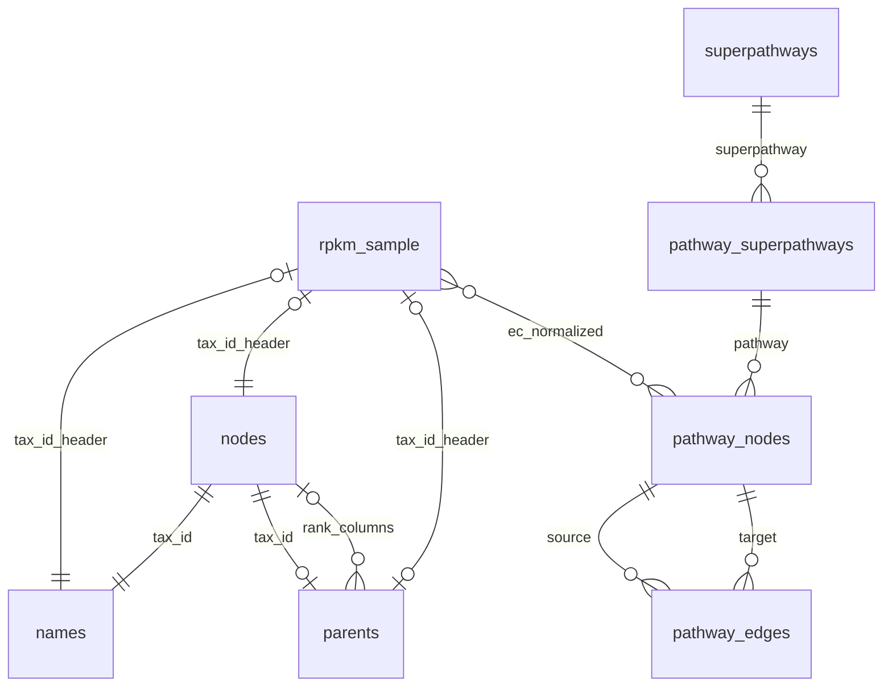

# Data Model

> Generated from exploratory analysis. Factual claims match stored notebook outputs in `analytics/exploration/notebooks/exploratory_analysis.ipynb`.

This document has two layers:

1. **As-found facts** — table schemas, row counts, RPKM shape (sections below through RPKM Wide Format).
2. **Intended logical model (observed-grounded)** — [Logical ER Diagram](#logical-er-diagram-observed-grounded), [edge evidence](#edge-evidence) (two directed rows per relationship), and regression validation targets. Use the **Review flag** column for open review items — there is no separate discrepancies section.

**Join convention:** Taxonomy joins use `tax_id`, not `names.id` (`names.id` is a UUID surrogate primary key from `write_to_tax_db.ipynb`).

## Reference Tables

Parquet reference tables are exported from SQLite and loaded by the notebook as DuckDB views.

| Table | Rows | Columns |
|---|---:|---|
| `names` | 2,840,139 | `id VARCHAR`, `tax_id BIGINT`, `name VARCHAR` |
| `nodes` | 2,840,139 | `id BIGINT` |
| `parents` | 2,840,134 | `id VARCHAR`, `tax_id BIGINT`, `t_kingdom BIGINT`, `t_phylum BIGINT`, `t_class BIGINT`, `t_order BIGINT`, `t_family BIGINT`, `t_genus BIGINT`, `t_species BIGINT` |
| `pathway_nodes` | 23,864 | `id VARCHAR`, `name VARCHAR`, `type VARCHAR`, `x BIGINT`, `y BIGINT`, `pathway BIGINT` |
| `pathway_edges` | 46,726 | `id VARCHAR`, `source VARCHAR`, `target VARCHAR`, `pathway BIGINT` |
| `pathway_superpathways` | 193 | `id BIGINT`, `name VARCHAR`, `superpathway VARCHAR` |
| `superpathways` | 13 | `id VARCHAR` (`uuid4()` surrogate), `name VARCHAR` |

**Superpathways (13 rows; names from KEGG BRITE `br08901` section B via `make_superpathway_db.ipynb`; full name list in §3):** Each row’s `id` is `str(uuid4())` at build time — a local surrogate primary key, not a KEGG identifier. Values change if the pathway DB is rebuilt; join on `id` within a dump, or on `name` for human-readable reference.

| name |
|---|
| Amino acid metabolism |
| Biosynthesis of other secondary metabolites |
| Carbohydrate metabolism |
| Chemical structure transformation maps |
| Energy metabolism |
| Global and overview maps |
| Glycan biosynthesis and metabolism |
| Lipid metabolism |
| Metabolism of cofactors and vitamins |
| Metabolism of other amino acids |
| Metabolism of terpenoids and polyketides |
| Nucleotide metabolism |
| Xenobiotics biodegradation and metabolism |

Key fields used by the app and EDA:

| Relationship | Key usage | Observed notebook result |
|---|---|---|
| `names.tax_id -> nodes.id` | Taxonomy name lookup | 0 orphan rows in the checked join (§6) |
| `parents.t_kingdom` … `t_species -> nodes.id` | Taxonomic rank lookup (all rank columns) | 0 orphan rows per rank column in §6 orphan-FK UNION |
| `pathway_edges.source -> pathway_nodes.id` | Pathway graph source node | 0 orphan rows in the checked join (§6) |
| `pathway_edges.target -> pathway_nodes.id` | Pathway graph target node | 0 orphan rows in the checked join (§6) |
| `pathway_superpathways.superpathway -> superpathways.id` | Superpathway lookup | 0 orphan rows in the checked join (§6) |
| `pathway_nodes.pathway -> pathway_superpathways.id` | Pathway group lookup | See `pathway_superpathways` → `pathway_nodes` edge evidence (§4) |

Additional cardinality checks (detail also in [Edge evidence](#edge-evidence)):

- `names` has exactly 1 row per `tax_id` in this dump: min 1, max 1, median 1.0, average 1.0 (§4).
- `parents` has 2,840,134 rows; 0 duplicate `tax_id` values (§6); exactly 5 nodes have no `parents` row — the meta/root allowlist below (§6; 0 unexpected parentless nodes).
- **Meta/root allowlist (no `parents` row permitted outside this set):**

| tax_id | scientific_name |
|---:|---|
| 1 | root |
| 10239 | Viruses |
| 131567 | cellular organisms |
| 2787823 | unclassified entries |
| 2787854 | other entries |

- Rank ladder completeness (§6): 0 `species_missing_upstream`, 0 `genus_missing_upstream`, 0 `family_missing_upstream`, 0 `order_missing_upstream`, 0 `class_missing_upstream`, 0 `phylum_missing_upstream`, 0 `kingdom_with_finer_but_missing_phylum` (2,840,134 `parents` rows checked).
- Rank transitive consistency (§6): 0 `genus_snapshot_mismatches`, 0 `family_snapshot_mismatches`, 0 `order_snapshot_mismatches`, 0 `class_snapshot_mismatches`, 0 `phylum_snapshot_mismatches`.
- Rank placement (§6): finest filled rank × placement pivot — **2,462,842** at-rank, **377,292** sub-rank. At-rank by finest rank: kingdom 45, phylum 116,166, class 28,532, order 43,650, family 167,488, genus 477,088, species 1,629,873. Sub-rank by finest rank: kingdom 465, phylum 1,062, class 2,248, order 6,567, family 21,625, genus 66,108, species 279,217 (below-species).
- Pathway graph degree is sparse and skewed: out-degree min 0, max 945, median 0.0; in-degree min 0, max 945, median 0.0 (§4).
- Pathway edge counts per pathway range from 2 to 2,410, with median 132.0 (§4).
- Displayed dangling-node output is led by pathway 1100 with 3,716 dangling nodes, pathway 1110 with 2,480, and pathway 1120 with 1,208 (§6).
- `pathway_nodes.type` is KGML **graphics shape**, not semantic role: `circle` 15,403, `rectangle` 7,169, `roundrectangle` 1,292 (§6). Circles carry compound ids (e.g. `C10216`); rectangles carry EC numbers or occasional compound/ellipsis labels.
- EC-dotted `pathway_nodes.name` values (pattern `^[0-9]+(\.[0-9]+){0,3}$`, 1–4 segments): **7,064** rows, **3,867** distinct names — all **4** segments in this dump (§6). RPKM fallback token `0.0.0.0` is **absent** from `pathway_nodes.name` (§6).
- EC-dotted names ⊆ `rectangle` type (**0** EC-dotted rows outside rectangles). `rectangle` ⊄ EC-dotted: **75** distinct non-EC rectangle names (**105** rows) — **61** compound ids (`C…`) and **14** ellipsis-truncated EC labels (`1.1.1.145…`, etc.) (§6). Prefer EC-dotted name matching over `type = 'rectangle'` for RPKM→pathway joins.

## RPKM Wide Format

Both sample files are wide TSVs. The fixed columns are:

`GeneID`, `Length`, `Reads`, `EC#`, `RPKM`, `Unclassified`

Every remaining column header is interpreted as a taxonomy `tax_id`. Cross-domain taxonomy joins are evaluated per tax_id column header, not per RPKM row.

| File | Rows | Tax_id columns | Size reported by notebook |
|---|---:|---:|---:|
| `test_rpkm_1.tsv` | 425,828 | 8 | 51.0 MB |
| `test_rpkm_2.tsv` | 461,112 | 12 | 71.1 MB |

Tax_id column overlap:

- `test_rpkm_1.tsv`: 8 tax_id columns.
- `test_rpkm_2.tsv`: 12 tax_id columns.
- Intersection: 6 tax_id columns.
- Only in `test_rpkm_1.tsv`: 2 tax_id columns.
- Only in `test_rpkm_2.tsv`: 6 tax_id columns.

RPKM sparsity was measured for `test_rpkm_1.tsv`: 3,406,624 tax_id cells, 59,439 nonzero cells, 1.74% nonzero.

EC normalization used for joins:

- Null, empty, `None`, `none`, `NA`, and `null` values normalize to `0.0.0.0`.
- `EC:x.y.z` values normalize to `x.y.z`.
- Existing non-prefixed values are preserved as strings.

The most common normalized EC output displayed for `test_rpkm_1.tsv` is `None -> 0.0.0.0` with 235,991 rows. The displayed top EC-prefixed row is `EC:2.7.13.3 -> 2.7.13.3` with 8,513 rows.

## Logical ER Diagram (Observed-Grounded)

Relationship-only Mermaid syntax (no entity attribute blocks). `rpkm_sample` stands for both `test_rpkm_1.tsv` and `test_rpkm_2.tsv`. Cardinalities on `rpkm_sample` taxonomy edges are **per tax_id column header** on the forward (header → reference) side; the `|o` on the `rpkm_sample` side means **0..1 column header per reference `tax_id` per sample file** (not globally — shared tax_ids appear in both files). The `rank_columns` edge is **per rank slot** (`t_kingdom` … `t_species`): each slot is an optional FK — **0..1** `nodes` row when non-null, **zero** when null (coarser ranks are more often populated; `t_species` is null in 931,044 / 2,840,134 rows).

### Edge evidence

Each **relationship** in the ER diagram has **two directed rows** (one per direction). **Intended** opens with a cardinality prefix (**1..1** exactly one, **0..1** zero or one, **0..n** zero or more; Mermaid `||`, `|o`, `}o` respectively), then plain words. **Observed** opens with a consistency verdict, then cites notebook evidence. **Enforced** opens with a category, then detail:

| Category | Meaning |
|---|---|
| **By design** | Optional or unbounded multiplicity is intentional domain shape; no schema rule should cap the count (e.g. zero dangling pathway nodes, shared rank ids, partial EC mapping). |
| **Not enforced** | A referential or coverage rule is intended logically but not declared in DDL, ETL, or file format — enforcement would be desirable but is not applied. |
| **SQLite FK** / **SQLite UNIQUE + FK** | Declared and active in the taxonomy/pathway database DDL. |
| **ETL filter** / **ETL / source data** | Guaranteed by build-notebook logic or upstream files, not SQLite constraints alone. |
| **App SQL** | Used in application queries only; not a database constraint. |
| **File format** | Guaranteed by the wide-TSV layout, not the reference database. |

Scope: `rpkm_sample` taxonomy joins are per tax_id column header; reverse joins to `rpkm_sample` are per sample file.

**Review flag:** `—` = no open item. Any other value is a note for human review or a regression validation target (not necessarily a defect).

| Relationship | From → To | Intended | Observed | Enforced | Review flag |
|---|---|---|---|---|---|
| `rpkm_sample` · `tax_id_header` | `rpkm_sample` → `names` | **1..1** · Each tax_id column header maps to exactly one `names` row | Consistent in test fixtures. 8/8 + 12/12 headers matched (§7) | Not enforced — cross-domain join; reference completeness not in DDL | — |
| `rpkm_sample` · `tax_id_header` | `names` → `rpkm_sample` | **0..1** · Each `names` row maps to zero or one tax_id column header per sample file | Consistent; by construction. Unique integer headers per file; 6 tax_ids shared across samples (§5) | File format — wide TSV column names unique per file | Re-validate if RPKM layout changes |
| `rpkm_sample` · `tax_id_header` | `rpkm_sample` → `nodes` | **1..1** · Each tax_id column header maps to exactly one `nodes` row | Consistent in test fixtures. 8/8 + 12/12 headers matched (§7) | Not enforced — cross-domain join; same as `names` | — |
| `rpkm_sample` · `tax_id_header` | `nodes` → `rpkm_sample` | **0..1** · Each `nodes` row maps to zero or one tax_id column header per sample file | Consistent; by construction. Same header-uniqueness as above (§5) | File format — wide TSV column names unique per file | Re-validate if RPKM layout changes |
| `rpkm_sample` · `tax_id_header` | `rpkm_sample` → `parents` | **0..1** · Each tax_id column header maps to zero or one `parents` row | Consistent in test fixtures. 8/8 + 12/12 headers had `parents` rows (§7) | Not enforced — cross-domain join; same as `names` | — |
| `rpkm_sample` · `tax_id_header` | `parents` → `rpkm_sample` | **0..1** · Each `parents` row maps to zero or one tax_id column header per sample file | Consistent; by construction. Same header-uniqueness as above (§5) | File format — wide TSV column names unique per file | Re-validate if RPKM layout changes |
| `rpkm_sample` · `ec_normalized` | `rpkm_sample` → `pathway_nodes` | **0..n** · Each RPKM row maps to zero or more `pathway_nodes` (via normalized `EC#`) | Consistent. 9,034 distinct ECs → 3,258 join rows in `test_rpkm_1.tsv` (§7) | By design — partial EC-to-KEGG mapping is expected | Track KEGG coverage — unmapped ECs expected |
| `rpkm_sample` · `ec_normalized` | `pathway_nodes` → `rpkm_sample` | **0..n** · Each `pathway_nodes` row maps to zero or more RPKM rows | Not measured. Fan-in expected (many rows per EC) | By design — fan-in is expected; no join rule in schema | — |
| `nodes` · `tax_id` | `nodes` → `names` | **1..1** · Each `nodes` row maps to exactly one `names` row | Consistent. min=max=1 `names` row per `tax_id` (§4) | ETL filter — `scientific name` only; no `UNIQUE` on `names.tax_id` | `names.tax_id` not `UNIQUE` in DDL — regression validation target |
| `nodes` · `tax_id` | `names` → `nodes` | **1..1** · Each `names` row maps to exactly one `nodes` row | Consistent. 0 orphan `names.tax_id`→`nodes`; 0 nodes without `names` (§6) | SQLite FK — `names.tax_id` → `nodes.id` | — |
| `nodes` · `tax_id` | `nodes` → `parents` | **0..1** · Each `nodes` row maps to zero or one `parents` row | Consistent. Exactly 5 parentless allowlist nodes; 0 unexpected (§6) | Not enforced — `tax_parents.csv` coverage; 5 meta/root exceptions by design | Allowlist enforced in §6 regression query |
| `nodes` · `tax_id` | `parents` → `nodes` | **1..1** · Each `parents` row maps to exactly one `nodes` row | Consistent. 0 duplicate `parents.tax_id`; 0 orphan `parents.tax_id`→`nodes` (§6) | SQLite UNIQUE + FK — `parents.tax_id` | — |
| `nodes` · `rank_columns` | `parents` → `nodes` | **0..1** · Each rank slot (`t_kingdom` … `t_species`) maps to zero or one `nodes` row when non-null | Consistent. Nullable slots common (`t_species` null in 931,044 rows); 0 orphans when non-null (§6) | SQLite FK — each `t_*` → `nodes.id` | — |
| `nodes` · `rank_columns` | `nodes` → `parents` | **0..n** · Each `nodes` row is referenced by zero or more `parents` rows per rank slot | Consistent. e.g. `t_kingdom`: min 1, max 1,322,687 `parents` rows per node, median 1,204 (§4) | By design — many taxa share the same rank node | — |
| `pathway_nodes` · `source` | `pathway_nodes` → `pathway_edges` | **0..n** · Each `pathway_nodes` row is source of zero or more `pathway_edges` | Consistent. Out-degree min 0, max 945, median 0 (§4); dangling nodes present (§6) | By design — dangling nodes are valid graph members | — |
| `pathway_nodes` · `source` | `pathway_edges` → `pathway_nodes` | **1..1** · Each `pathway_edges` row maps to exactly one source `pathway_nodes` row | Consistent. 0 orphan `source`→`pathway_nodes` (§6) | SQLite FK — `pathway_edges.source` | — |
| `pathway_nodes` · `target` | `pathway_nodes` → `pathway_edges` | **0..n** · Each `pathway_nodes` row is target of zero or more `pathway_edges` | Consistent. In-degree min 0, max 945, median 0 (§4) | By design — dangling nodes are valid graph members | — |
| `pathway_nodes` · `target` | `pathway_edges` → `pathway_nodes` | **1..1** · Each `pathway_edges` row maps to exactly one target `pathway_nodes` row | Consistent. 0 orphan `target`→`pathway_nodes` (§6) | SQLite FK — `pathway_edges.target` | — |
| `pathway_superpathways` · `pathway` | `pathway_superpathways` → `pathway_nodes` | **0..n** · Each `pathway_superpathways` row has zero or more `pathway_nodes` | Consistent. 23/193 without nodes; min 1, max 3,716, median 91.5 nodes per id (§4) | By design — empty pathway groups are valid | — |
| `pathway_superpathways` · `pathway` | `pathway_nodes` → `pathway_superpathways` | **1..1** · Each `pathway_nodes` row maps to exactly one `pathway_superpathways` row | Consistent. 0 orphan `pathway`→`psp` (23,864/23,864); 0 null `pathway` on nodes (§4) | Not enforced — logical join in app SQL; no SQLite FK on `pathway_nodes.pathway` | — |
| `superpathways` · `superpathway` | `superpathways` → `pathway_superpathways` | **0..n** · Each `superpathways` row has zero or more `pathway_superpathways` rows | Consistent. min 2, max 31, median 14 `pathway_superpathways` per superpathway; 0 superpathways without psp (§4) | By design — grouping cardinality is open-ended | — |
| `superpathways` · `superpathway` | `pathway_superpathways` → `superpathways` | **1..1** · Each `pathway_superpathways` row maps to exactly one `superpathways` row | Consistent. 0 orphan `superpathway`→`superpathways` (§6) | SQLite FK — `pathway_superpathways.superpathway` | — |

**Attribute note (not an ER edge):** `pathway_nodes.name` is not unique — top duplicate `1.14.14.1`: 77 rows (§6). **Enforced:** By design — duplicate EC labels are valid. `pathway_nodes.type` stores KGML graphics shape (`circle` / `rectangle` / `roundrectangle`), not enzyme vs compound semantics (§6).

## Regression Validation Targets

Invariants that hold in the current dump but are not fully guaranteed by SQLite DDL, upstream NCBI files, or ad-hoc build notebooks. Re-run the notebook checks when the trigger column applies.

| Invariant | Holds today | Guaranteed by | Re-validate when |
|---|---|---|---|
| Exactly one `names` row per `tax_id` | Yes (min=max=1) | ETL filter (`scientific name` only), not `UNIQUE` on `names.tax_id` | `write_to_tax_db.ipynb` or NCBI names source changes |
| `names.tax_id` → `nodes.id` orphan-free | Yes (0 orphans) | SQLite FK on `names.tax_id` | After DB rebuild |
| At most one `parents` row per `tax_id` | Yes (0 duplicates) | `UNIQUE` on `parents.tax_id` in DDL | After DB rebuild |
| Parentless nodes are exactly the 5 meta/root allowlist | Yes (`parentless_count=5`, `unexpected_parentless=0`, `missing_allowed=0`; see allowlist table above) | `tax_parents.csv` coverage only; §6 allowlist query | `tax_parents.csv`, parents ETL, or NCBI taxonomy refresh |
| `parents` rank ladder completeness | Yes (all violation counts 0) | `tax_parents.csv` denormalization only | `tax_parents.csv` or parents ETL changes |
| `parents` rank column → `nodes.id` orphan-free | Yes (0 orphans per rank column) | SQLite FK on each `t_kingdom` … `t_species` in `parents` DDL | After DB rebuild or parents ETL changes |
| `parents` rank transitive consistency | Yes (0 snapshot mismatches at genus, family, order, class, phylum) | Denormalized rank snapshots in `tax_parents.csv` | `tax_parents.csv` or parents ETL changes |
| RPKM tax_id header → exactly one `nodes`/`names` | Yes in test fixtures (100%) | MetaPro output + reference completeness | New RPKM samples or taxonomy refresh |
| Reference `tax_id` → ≤1 column header per sample file | Yes (unique headers) | Wide TSV format: column names unique per file | New RPKM layout or format change |
| RPKM EC → KEGG `pathway_nodes` coverage | Partial by design | 9,034 distinct normalized ECs → 3,258 join rows in `test_rpkm_1.tsv` (§7) | MetaPro EC universe vs KEGG map scope | New RPKM samples or pathway DB refresh |

## Gotchas For Future Analytics

- Do not treat tax_id headers as ordinary row values until the RPKM tables are unpivoted.
- Join taxonomy on `tax_id`, not `names.id` (UUID surrogate).
- Normalize `EC#` values before joining to pathway tables, and expect `0.0.0.0` to dominate when `EC#` is absent. `0.0.0.0` does not appear in `pathway_nodes.name`, so the fallback does not collide with KEGG reference labels (§6). Not every normalized EC appears in KEGG `pathway_nodes`; track join-row coverage for analytics, not as a defect.
- `pathway_nodes.type` is a graphics shape from KGML, not a semantic filter. EC-dotted names are a strict subset of `rectangle` nodes; some rectangles are compound ids or truncated labels (§6). Match joins on EC-dotted `name` patterns, not on `type`.
- `pathway_nodes.name` is many-to-one from the perspective of EC labels; downstream summaries should decide whether to count distinct ECs, pathway nodes, pathways, or superpathways.
- Several notebook outputs are display-limited top-N tables. For exhaustive audits, rerun or extend the underlying SQL cells rather than inferring from visible rows alone.
- Keep this document updated when new dumps or sample files are introduced; re-run regression validation targets on data refresh.
