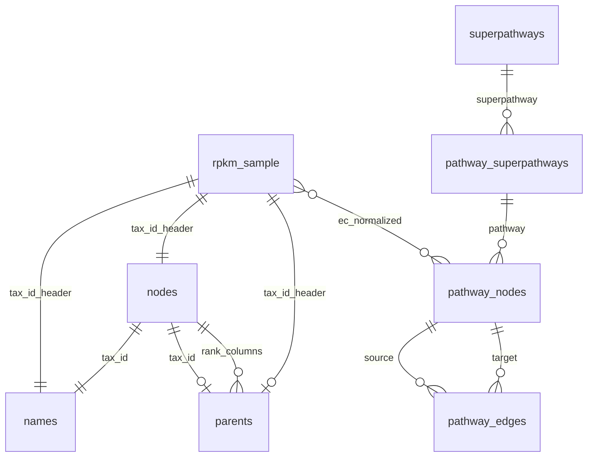

# Exploratory Data Analysis Implementation Plan

> **For agentic workers:** REQUIRED SUB-SKILL: Use superpowers:subagent-driven-development (recommended) or superpowers:executing-plans to implement this plan task-by-task. Steps use checkbox (`- [ ]`) syntax for tracking.

**Goal:** Stand up reproducible SQL-first EDA for MetaPro RPKM samples and taxonomy/pathway reference data, with Parquet dumps, a JupySQL notebook, and documentation of as-found relationships.

**Architecture:** Two-step pipeline — `export_parquet.py` (DuckDB attaches SQLite, writes Parquet) runs outside the notebook; `exploratory_analysis.ipynb` reads only Parquet + RPKM TSVs via DuckDB/JupySQL `%%sql` cells. Large artifacts tracked via Git LFS. All work on branch `exploration/eda` in worktree `.worktrees/exploration-eda/`.

**Tech Stack:** Python 3.14, uv, DuckDB, JupySQL, Jupyter, Git LFS

**Spec:** `docs/superpowers/specs/2026-06-11-exploratory-analysis-design.md`

---

## File Map

| File | Action | Responsibility |
|---|---|---|
| `analytics/pyproject.toml` | Create | uv project, runtime + dev deps |
| `analytics/uv.lock` | Create | Locked dependencies |
| `analytics/exploration/README.md` | Create | Setup, two-step workflow, immutability rules |
| `analytics/exploration/scripts/export_parquet.py` | Create | SQLite → Parquet for 7 tables |
| `analytics/exploration/scripts/test_export_parquet.py` | Create | Smoke test row counts vs SQLite |
| `analytics/exploration/notebooks/exploratory_analysis.ipynb` | Create | All EDA SQL + committed outputs |
| `analytics/exploration/docs/data-model.md` | Create / extend | Data dictionary + observed-grounded logical ER diagram |
| `.gitattributes` | Create | LFS rules for Parquet + RPKM TSVs |
| `.gitignore` | Modify | Allow `resources/db/parquet/`, `test_rpkm_*.tsv` |
| `resources/db/parquet/*.parquet` | Create (LFS) | Version-controlled reference dumps |
| `resources/example_data/test_rpkm_1.tsv` | Track (LFS) | Sample input 1 |
| `resources/example_data/test_rpkm_2.tsv` | Track (LFS) | Sample input 2 |

---

## Task 1: Python environment

**Files:**
- Create: `analytics/pyproject.toml`
- Create: `analytics/uv.lock` (via `uv lock`)

- [ ] **Step 1: Create `analytics/pyproject.toml`**

```toml
[project]
name = "metapro-analytics"
version = "0.1.0"
description = "Analytics for Metapro Viz (exploration and future transform)"
requires-python = ">=3.14"
dependencies = [
    "duckdb>=1.5",
    "jupysql>=0.11",
    "jupyter>=1.1",
    "ipykernel>=6.29",
]

[dependency-groups]
dev = [
    "pytest>=8.0",
]

[tool.pytest.ini_options]
testpaths = ["exploration/scripts"]
```

- [ ] **Step 2: Install and lock**

```bash
cd analytics
uv sync
```

Expected: `uv.lock` created; `.venv` inside `analytics/` with duckdb, jupysql, jupyter, pytest.

- [ ] **Step 3: Verify DuckDB import**

```bash
cd analytics
uv run python -c "import duckdb; import jupysql; print('ok', duckdb.__version__)"
```

Expected: `ok 1.5.x` (no import error).

- [ ] **Step 4: Commit**

```bash
git add analytics/pyproject.toml analytics/uv.lock
git commit -m "feat(analytics): add uv Python environment for exploration"
```

---

## Task 2: Git LFS and gitignore

**Files:**
- Create: `.gitattributes`
- Modify: `.gitignore`

- [ ] **Step 1: Create `.gitattributes`**

```
*.parquet filter=lfs diff=lfs merge=lfs -text
resources/example_data/test_rpkm_*.tsv filter=lfs diff=lfs merge=lfs -text
```

- [ ] **Step 2: Update `.gitignore` — allow Parquet and RPKM through `resources/*`**

Append after existing `resources/*` block:

```gitignore
!resources/db/
!resources/db/parquet/
!resources/db/parquet/**
!resources/example_data/test_rpkm_1.tsv
!resources/example_data/test_rpkm_2.tsv
```

- [ ] **Step 3: Verify git-lfs is available**

```bash
git lfs version
```

Expected: `git-lfs/3.x.x`. If missing, install (`brew install git-lfs && git lfs install`).

- [ ] **Step 4: Commit**

```bash
git add .gitattributes .gitignore
git commit -m "chore: configure Git LFS for Parquet and RPKM sample files"
```

---

## Task 3: Parquet export script

**Files:**
- Create: `analytics/exploration/scripts/export_parquet.py`
- Create: `analytics/exploration/scripts/test_export_parquet.py`

- [ ] **Step 1: Write failing test**

```python
# analytics/exploration/scripts/test_export_parquet.py
from pathlib import Path

import duckdb
import pytest

REPO_ROOT = Path(__file__).resolve().parents[3]
DB_PATH = REPO_ROOT / "resources/db/taxonomy.db"
PARQUET_DIR = REPO_ROOT / "resources/db/parquet"

TABLES = [
    "names",
    "nodes",
    "parents",
    "pathway_nodes",
    "pathway_edges",
    "pathway_superpathways",
    "superpathways",
]

pytestmark = pytest.mark.skipif(
    not DB_PATH.exists(),
    reason="taxonomy.db not present locally",
)


def test_parquet_row_counts_match_sqlite():
    import sys

    sys.path.insert(0, str(Path(__file__).resolve().parent))
    import export_parquet

    export_parquet.main()

    conn = duckdb.connect()
    conn.execute(f"ATTACH '{DB_PATH}' AS db (TYPE SQLITE)")
    for table in TABLES:
        sqlite_count = conn.execute(f"SELECT COUNT(*) FROM db.{table}").fetchone()[0]
        parquet_count = conn.execute(
            f"SELECT COUNT(*) FROM '{PARQUET_DIR / f'{table}.parquet'}'"
        ).fetchone()[0]
        assert parquet_count == sqlite_count, f"{table}: {parquet_count} != {sqlite_count}"
```

- [ ] **Step 2: Run test to verify it fails**

```bash
cd analytics
uv run pytest exploration/scripts/test_export_parquet.py -v
```

Expected: FAIL — `ModuleNotFoundError: No module named 'export_parquet'` or import error.

- [ ] **Step 3: Implement `export_parquet.py`**

```python
#!/usr/bin/env python3
"""Export taxonomy.db tables to Parquet files for version-controlled EDA."""
from __future__ import annotations

import sys
from pathlib import Path

import duckdb

REPO_ROOT = Path(__file__).resolve().parents[3]
DB_PATH = REPO_ROOT / "resources/db/taxonomy.db"
PARQUET_DIR = REPO_ROOT / "resources/db/parquet"

TABLES = [
    "names",
    "nodes",
    "parents",
    "pathway_nodes",
    "pathway_edges",
    "pathway_superpathways",
    "superpathways",
]


def main() -> None:
    if not DB_PATH.exists():
        print(f"ERROR: {DB_PATH} not found", file=sys.stderr)
        sys.exit(1)

    PARQUET_DIR.mkdir(parents=True, exist_ok=True)
    conn = duckdb.connect()
    conn.execute(f"ATTACH '{DB_PATH}' AS db (TYPE SQLITE)")

    for table in TABLES:
        out = PARQUET_DIR / f"{table}.parquet"
        conn.execute(f"COPY db.{table} TO '{out}' (FORMAT PARQUET)")
        row_count = conn.execute(f"SELECT COUNT(*) FROM '{out}'").fetchone()[0]
        size_mb = out.stat().st_size / (1024 * 1024)
        print(f"{table}: {row_count:,} rows → {out} ({size_mb:.1f} MB)")

    print("Done.")


if __name__ == "__main__":
    main()
```

- [ ] **Step 4: Run test to verify it passes**

```bash
cd analytics
uv run pytest exploration/scripts/test_export_parquet.py -v
```

Expected: PASS (requires `resources/db/taxonomy.db` present).

- [ ] **Step 5: Run export and inspect output**

```bash
cd analytics
uv run python exploration/scripts/export_parquet.py
ls -lh ../resources/db/parquet/
```

Expected: 7 `.parquet` files; row counts match spec (~2.8M for taxonomy tables).

- [ ] **Step 6: Commit script + test + Parquet (LFS)**

```bash
git add analytics/exploration/scripts/export_parquet.py \
        analytics/exploration/scripts/test_export_parquet.py \
        resources/db/parquet/
git commit -m "feat(analytics): add Parquet export script and reference dumps"
```

Verify LFS tracking: `git lfs ls-files` should list 7 parquet files.

---

## Task 4: Track RPKM samples via LFS

**Files:**
- Track: `resources/example_data/test_rpkm_1.tsv`, `test_rpkm_2.tsv`

- [ ] **Step 1: Verify files exist locally**

```bash
ls -lh resources/example_data/test_rpkm_*.tsv
```

- [ ] **Step 2: Add and commit via LFS**

```bash
git add resources/example_data/test_rpkm_1.tsv resources/example_data/test_rpkm_2.tsv
git commit -m "data: track RPKM sample files via Git LFS"
```

Verify: `git lfs ls-files` lists both TSVs.

---

## Task 5: Exploration README

**Files:**
- Create: `analytics/exploration/README.md`

- [ ] **Step 1: Write README**

```markdown
# Exploratory Data Analysis

SQL-first validation of MetaPro RPKM sample data against taxonomy/pathway reference tables.

## Prerequisites

- Python 3.14 (see repo-root `.python-version`)
- [uv](https://docs.astral.sh/uv/)
- [Git LFS](https://git-lfs.com/)
- `resources/db/taxonomy.db` (local, gitignored — needed only to refresh Parquet dumps)

## Setup

```bash
cd analytics
uv sync
git lfs pull   # if cloning fresh
```

## Two-step workflow

### Step 1 — Produce dumps (when `taxonomy.db` changes)

```bash
cd analytics
uv run python exploration/scripts/export_parquet.py
```

### Step 2 — Run analysis

```bash
cd analytics
uv run jupyter execute exploration/notebooks/exploratory_analysis.ipynb
```

## Development rules

1. Test SQL via CLI before adding to notebook: `uv run python -c "import duckdb; ..."`
2. Integrate validated SQL into `%%sql` cells
3. Execute full notebook to refresh outputs
4. **Never hand-edit notebook output cells**
5. Parquet changes only via `export_parquet.py`

## Layout

- `scripts/export_parquet.py` — infrastructure (SQLite → Parquet)
- `notebooks/exploratory_analysis.ipynb` — all analysis code + results
- `docs/data-model.md` — data dictionary and as-found relationships
```

- [ ] **Step 2: Commit**

```bash
git add analytics/exploration/README.md
git commit -m "docs(analytics): add exploration README with two-step workflow"
```

---

## Task 6: Notebook scaffold (setup + verify inputs)

**Files:**
- Create: `analytics/exploration/notebooks/exploratory_analysis.ipynb`

- [ ] **Step 1: Create notebook with cells 1–2**

**Cell 1 (markdown):** Title and link to spec/README.

**Cell 2 (python) — Setup:**

```python
from pathlib import Path

import duckdb

%load_ext sql

REPO_ROOT = Path("..").resolve().parents[2]  # notebooks → exploration → analytics → repo root
PARQUET_DIR = REPO_ROOT / "resources/db/parquet"
RPKM_FILES = [
    REPO_ROOT / "resources/example_data/test_rpkm_1.tsv",
    REPO_ROOT / "resources/example_data/test_rpkm_2.tsv",
]
TABLES = [
    "names", "nodes", "parents",
    "pathway_nodes", "pathway_edges",
    "pathway_superpathways", "superpathways",
]
KEY_COLS = ["GeneID", "Length", "Reads", "EC#", "RPKM", "Unclassified"]

conn = duckdb.connect()
%sql conn --alias duckdb

print(f"Repo root: {REPO_ROOT}")
```

**Cell 3 (python) — Verify inputs:**

```python
import sys

missing = []
for table in TABLES:
    p = PARQUET_DIR / f"{table}.parquet"
    if not p.exists():
        missing.append(str(p))
for rpkm in RPKM_FILES:
    if not rpkm.exists():
        missing.append(str(rpkm))

if missing:
    print("MISSING INPUT FILES:")
    for m in missing:
        print(f"  - {m}")
    print("\nRun: uv run python exploration/scripts/export_parquet.py")
    sys.exit(1)

for table in TABLES:
    p = PARQUET_DIR / f"{table}.parquet"
    n = conn.execute(f"SELECT COUNT(*) FROM '{p}'").fetchone()[0]
    mb = p.stat().st_size / (1024 * 1024)
    print(f"{table}: {n:,} rows ({mb:.1f} MB)")

for rpkm in RPKM_FILES:
    mb = rpkm.stat().st_size / (1024 * 1024)
    print(f"{rpkm.name}: {mb:.1f} MB")

print("All inputs present.")
```

- [ ] **Step 2: Execute notebook to verify cells 1–3**

```bash
cd analytics
uv run jupyter execute exploration/notebooks/exploratory_analysis.ipynb
```

Expected: exits 0; prints row counts for 7 tables.

- [ ] **Step 3: Commit**

```bash
git add analytics/exploration/notebooks/exploratory_analysis.ipynb
git commit -m "feat(analytics): scaffold exploration notebook with input verification"
```

---

## Task 7: Data dictionary (notebook section 3)

**Files:**
- Modify: `analytics/exploration/notebooks/exploratory_analysis.ipynb`

- [ ] **Step 1: Add markdown cell — "3. Data Dictionary"**

- [ ] **Step 2: Python cell — register Parquet as views**

JupySQL native DuckDB connections do not substitute Python variables in `%%sql` cells. Register views first:

```python
for table in TABLES:
    conn.execute(f"""
        CREATE OR REPLACE VIEW {table} AS
        SELECT * FROM '{PARQUET_DIR / f"{table}.parquet"}'
    """)
print("Views created for all reference tables.")
```

Then `%%sql` cells query `names`, `nodes`, etc. directly.

- [ ] **Step 3: Add `%%sql` cell — schema per table**

```sql
DESCRIBE names;
```

Repeat in separate cells or one union for all tables.

- [ ] **Step 4: Add `%%sql` cell — row counts**

```sql
SELECT 'names' AS tbl, COUNT(*) AS n FROM names
UNION ALL SELECT 'nodes', COUNT(*) FROM nodes
UNION ALL SELECT 'parents', COUNT(*) FROM parents
UNION ALL SELECT 'pathway_nodes', COUNT(*) FROM pathway_nodes
UNION ALL SELECT 'pathway_edges', COUNT(*) FROM pathway_edges
UNION ALL SELECT 'pathway_superpathways', COUNT(*) FROM pathway_superpathways
UNION ALL SELECT 'superpathways', COUNT(*) FROM superpathways
ORDER BY tbl;
```

- [ ] **Step 5: Execute notebook, commit**

```bash
cd analytics && uv run jupyter execute exploration/notebooks/exploratory_analysis.ipynb
git add analytics/exploration/notebooks/exploratory_analysis.ipynb
git commit -m "feat(analytics): add data dictionary section to exploration notebook"
```

---

## Task 8: Cardinality and degrees (notebook section 4)

**Files:**
- Modify: `analytics/exploration/notebooks/exploratory_analysis.ipynb`

- [ ] **Step 1: Add `%%sql` — names per tax_id**

```sql
SELECT
    MIN(name_count) AS min_names,
    MAX(name_count) AS max_names,
    MEDIAN(name_count) AS median_names,
    AVG(name_count) AS avg_names
FROM (
    SELECT tax_id, COUNT(*) AS name_count
    FROM names
    GROUP BY tax_id
);
```

- [ ] **Step 2: Add `%%sql` — pathway in/out degree**

```sql
WITH out_degree AS (
    SELECT source AS node_id, COUNT(*) AS out_deg
    FROM pathway_edges GROUP BY source
),
in_degree AS (
    SELECT target AS node_id, COUNT(*) AS in_deg
    FROM pathway_edges GROUP BY target
),
all_nodes AS (
    SELECT id AS node_id FROM pathway_nodes
)
SELECT
    'out_degree' AS metric,
    MIN(COALESCE(o.out_deg, 0)) AS min,
    MAX(COALESCE(o.out_deg, 0)) AS max,
    MEDIAN(COALESCE(o.out_deg, 0)) AS median
FROM all_nodes n LEFT JOIN out_degree o ON n.node_id = o.node_id
UNION ALL
SELECT
    'in_degree',
    MIN(COALESCE(i.in_deg, 0)),
    MAX(COALESCE(i.in_deg, 0)),
    MEDIAN(COALESCE(i.in_deg, 0))
FROM all_nodes n LEFT JOIN in_degree i ON n.node_id = i.node_id;
```

- [ ] **Step 3: Add `%%sql` — edges per pathway**

```sql
SELECT
    MIN(edge_count) AS min_edges,
    MAX(edge_count) AS max_edges,
    MEDIAN(edge_count) AS median_edges
FROM (
    SELECT pathway, COUNT(*) AS edge_count
    FROM pathway_edges
    GROUP BY pathway
);
```

- [ ] **Step 4: Execute notebook, commit**

```bash
cd analytics && uv run jupyter execute exploration/notebooks/exploratory_analysis.ipynb
git add analytics/exploration/notebooks/exploratory_analysis.ipynb
git commit -m "feat(analytics): add cardinality and degree stats to exploration notebook"
```

---

## Task 9: RPKM profiling (notebook section 5)

**Files:**
- Modify: `analytics/exploration/notebooks/exploratory_analysis.ipynb`

- [ ] **Step 1: Python cell — register RPKM files as views**

```python
for i, rpkm_path in enumerate(RPKM_FILES, start=1):
    conn.execute(f"""
        CREATE OR REPLACE VIEW rpkm_{i} AS
        SELECT * FROM read_csv('{rpkm_path}', delim='\\t', header=true, auto_detect=true)
    """)
    n = conn.execute(f"SELECT COUNT(*) FROM rpkm_{i}").fetchone()[0]
    print(f"rpkm_{i} ({rpkm_path.name}): {n:,} rows")
```

- [ ] **Step 2: `%%sql` — EC value distribution (rpkm_1)**

```sql
SELECT
    "EC#" AS ec_raw,
    CASE
        WHEN "EC#" IS NULL OR TRIM(CAST("EC#" AS VARCHAR)) IN ('', 'None', 'none', 'NA', 'null') THEN '0.0.0.0'
        WHEN STARTS_WITH(CAST("EC#" AS VARCHAR), 'EC:') THEN SUBSTR(CAST("EC#" AS VARCHAR), 4)
        ELSE CAST("EC#" AS VARCHAR)
    END AS ec_normalized,
    COUNT(*) AS row_count
FROM rpkm_1
GROUP BY 1, 2
ORDER BY row_count DESC
LIMIT 20;
```

- [ ] **Step 3: `%%sql` — tax column count and sparsity (rpkm_1)**

Use python to list tax columns dynamically, then SQL. **Python cell:**

```python
cols = conn.execute("SELECT * FROM rpkm_1 LIMIT 0").description
all_cols = [c[0] for c in cols]
tax_cols = [c for c in all_cols if c not in KEY_COLS]
print(f"Tax_id columns: {len(tax_cols)}")
conn.execute(f"SET tax_columns = '{','.join(tax_cols)}'")  # for reference only
```

**`%%sql` cell — non-null cell rate for first tax column as spot-check:**

```sql
SELECT
    COUNT(*) AS total_rows,
    COUNT(CASE WHEN COLUMNS(*) IS NOT NULL THEN 1 END) AS placeholder
FROM rpkm_1;
```

For full sparsity, add a python loop or dynamic UNPIVOT. **Python cell for unpivot-based sparsity:**

```python
tax_cols_sql = ", ".join(f'"{c}"' for c in tax_cols)
conn.execute(f"""
    CREATE OR REPLACE VIEW rpkm_1_long AS
    UNPIVOT rpkm_1
    ON {tax_cols_sql}
    INTO NAME tax_id VALUE rpkm_value
""")
print("rpkm_1 sparsity:", conn.execute("""
    SELECT
        COUNT(*) AS total_cells,
        COUNT(CASE WHEN rpkm_value > 0 THEN 1 END) AS nonzero_cells,
        ROUND(100.0 * COUNT(CASE WHEN rpkm_value > 0 THEN 1 END) / COUNT(*), 2) AS pct_nonzero
    FROM rpkm_1_long
""").fetchone())
```

- [ ] **Step 4: `%%sql` — file overlap (distinct tax_id headers)**

**Python cell:**

```python
tax_set_1 = set(tax_cols)  # from rpkm_1
cols2 = [c[0] for c in conn.execute("SELECT * FROM rpkm_2 LIMIT 0").description]
tax_set_2 = set(c for c in cols2 if c not in KEY_COLS)
print(f"rpkm_1 tax columns: {len(tax_set_1)}")
print(f"rpkm_2 tax columns: {len(tax_set_2)}")
print(f"intersection: {len(tax_set_1 & tax_set_2)}")
print(f"only in rpkm_1: {len(tax_set_1 - tax_set_2)}")
print(f"only in rpkm_2: {len(tax_set_2 - tax_set_1)}")
```

- [ ] **Step 5: Execute notebook, commit**

```bash
cd analytics && uv run jupyter execute exploration/notebooks/exploratory_analysis.ipynb
git add analytics/exploration/notebooks/exploratory_analysis.ipynb
git commit -m "feat(analytics): add RPKM profiling section to exploration notebook"
```

---

## Task 10: Reference integrity (notebook section 6)

**Files:**
- Modify: `analytics/exploration/notebooks/exploratory_analysis.ipynb`

- [ ] **Step 1: `%%sql` — orphan FK checks**

```sql
SELECT 'names.tax_id → nodes' AS fk,
       COUNT(*) AS orphan_count
FROM names n
LEFT JOIN nodes nd ON n.tax_id = nd.id
WHERE nd.id IS NULL
UNION ALL
SELECT 'parents.t_kingdom → nodes', COUNT(*)
FROM parents p LEFT JOIN nodes nd ON p.t_kingdom = nd.id
WHERE p.t_kingdom IS NOT NULL AND nd.id IS NULL
UNION ALL
SELECT 'pathway_edges.source → pathway_nodes', COUNT(*)
FROM pathway_edges e LEFT JOIN pathway_nodes pn ON e.source = pn.id
WHERE pn.id IS NULL
UNION ALL
SELECT 'pathway_superpathways.superpathway → superpathways', COUNT(*)
FROM pathway_superpathways ps LEFT JOIN superpathways sp ON ps.superpathway = sp.id
WHERE sp.id IS NULL;
```

- [ ] **Step 2: `%%sql` — duplicate EC names in pathway_nodes**

```sql
SELECT name, COUNT(*) AS n
FROM pathway_nodes
GROUP BY name
HAVING COUNT(*) > 1
ORDER BY n DESC
LIMIT 20;
```

- [ ] **Step 3: `%%sql` — rank completeness**

```sql
SELECT
    COUNT(*) AS total,
    COUNT(CASE WHEN t_genus IS NOT NULL AND t_family IS NULL THEN 1 END) AS genus_without_family,
    COUNT(CASE WHEN t_genus IS NOT NULL AND t_order IS NULL THEN 1 END) AS genus_without_order,
    COUNT(CASE WHEN t_phylum IS NOT NULL AND t_kingdom IS NULL THEN 1 END) AS phylum_without_kingdom
FROM parents;
```

- [ ] **Step 4: `%%sql` — dangling pathway nodes**

```sql
SELECT pn.pathway, COUNT(*) AS dangling_nodes
FROM pathway_nodes pn
LEFT JOIN pathway_edges e ON pn.id = e.source OR pn.id = e.target
WHERE e.id IS NULL
GROUP BY pn.pathway
ORDER BY dangling_nodes DESC
LIMIT 10;
```

- [ ] **Step 5: Execute notebook, commit**

```bash
cd analytics && uv run jupyter execute exploration/notebooks/exploratory_analysis.ipynb
git add analytics/exploration/notebooks/exploratory_analysis.ipynb
git commit -m "feat(analytics): add reference integrity checks to exploration notebook"
```

---

## Task 11: Cross-domain joins (notebook section 7)

**Files:**
- Modify: `analytics/exploration/notebooks/exploratory_analysis.ipynb`

- [ ] **Step 1: Python cell — tax_id header match rates**

```python
def tax_id_match_rates(tax_ids: set[str], label: str) -> None:
    ids_int = [int(t) for t in tax_ids]
    conn.execute("CREATE OR REPLACE TEMP TABLE rpk_tax_ids (tax_id INT)")
    conn.executemany("INSERT INTO rpk_tax_ids VALUES (?)", [(i,) for i in ids_int])
    r = conn.execute("""
        SELECT
            (SELECT COUNT(*) FROM rpk_tax_ids) AS total_headers,
            (SELECT COUNT(*) FROM rpk_tax_ids r JOIN names n ON r.tax_id = n.tax_id) AS matched_names,
            (SELECT COUNT(DISTINCT r.tax_id) FROM rpk_tax_ids r JOIN names n ON r.tax_id = n.tax_id) AS distinct_tax_ids_with_names,
            (SELECT COUNT(*) FROM rpk_tax_ids r JOIN nodes nd ON r.tax_id = nd.id) AS matched_nodes,
            (SELECT COUNT(*) FROM rpk_tax_ids r JOIN parents p ON r.tax_id = p.tax_id) AS matched_parents
    """).fetchone()
    print(f"--- {label} ---")
    print(f"  tax_id column headers: {r[0]}")
    print(f"  headers with ≥1 names row: {r[1]} (distinct tax_ids: {r[2]})")
    print(f"  headers with nodes row: {r[3]}")
    print(f"  headers with parents row: {r[4]}")

tax_id_match_rates(tax_set_1, "test_rpkm_1")
tax_id_match_rates(tax_set_2, "test_rpkm_2")
```

- [ ] **Step 2: `%%sql` — unmapped tax_id headers (rpkm_1)**

```sql
SELECT r.tax_id
FROM rpk_tax_ids r
LEFT JOIN names n ON r.tax_id = n.tax_id
WHERE n.tax_id IS NULL
ORDER BY r.tax_id
LIMIT 20;
```

- [ ] **Step 3: `%%sql` — EC → pathway_nodes match rate**

```sql
WITH normalized AS (
    SELECT DISTINCT
        CASE
            WHEN "EC#" IS NULL OR TRIM(CAST("EC#" AS VARCHAR)) IN ('', 'None', 'none', 'NA', 'null') THEN '0.0.0.0'
            WHEN STARTS_WITH(CAST("EC#" AS VARCHAR), 'EC:') THEN SUBSTR(CAST("EC#" AS VARCHAR), 4)
            ELSE CAST("EC#" AS VARCHAR)
        END AS ec
    FROM rpkm_1
)
SELECT
    (SELECT COUNT(*) FROM normalized) AS distinct_ecs,
    (SELECT COUNT(*) FROM normalized n JOIN pathway_nodes pn ON n.ec = pn.name) AS matched_pathway_nodes
;
```

- [ ] **Step 4: `%%sql` — broken superpathway chain**

```sql
SELECT pn.name AS ec, pn.pathway, psp.id AS psp_id, sp.id AS sp_id
FROM pathway_nodes pn
LEFT JOIN pathway_superpathways psp ON pn.pathway = psp.id
LEFT JOIN superpathways sp ON psp.superpathway = sp.id
WHERE psp.id IS NULL OR sp.id IS NULL
LIMIT 20;
```

- [ ] **Step 5: Execute notebook, commit**

```bash
cd analytics && uv run jupyter execute exploration/notebooks/exploratory_analysis.ipynb
git add analytics/exploration/notebooks/exploratory_analysis.ipynb
git commit -m "feat(analytics): add cross-domain join validation to exploration notebook"
```

---

## Task 12: Findings summary and data-model doc

**Files:**
- Modify: `analytics/exploration/notebooks/exploratory_analysis.ipynb`
- Create: `analytics/exploration/docs/data-model.md`

- [ ] **Step 1: Add markdown cell 8 — "Findings Summary"**

Template (fill with actual numbers from executed notebook outputs):

```markdown
## 8. Findings Summary

### Validated assumptions
- [ ] Parquet row counts match SQLite source
- [ ] ...

### Discrepancies vs logical model (see spec §14)
| Edge | Expected | Observed | Problem? |
|---|---|---|---|
| RPKM → parents | 0..1 per header | _(from §7)_ | _(review)_ |

### Gotchas for future analytics
- ...
```

- [ ] **Step 2: Write `data-model.md` from notebook results**

Structure:

```markdown
# Data Model — As Found

> Generated from exploratory analysis. Factual claims match notebook outputs.

## Reference tables
(table schemas, row counts, PK/FK)

## RPKM wide format
(fixed columns, tax_id column headers, EC normalization)

## Logical relationships (as-found)
(per-header join match rates, orphan FK counts)

## Discrepancies vs pre-validation model
(flagged for review — not pre-judged as bugs)
```

Populate with actual values after notebook execution.

> **Follow-up:** Task 14 adds the observed-grounded logical ER diagram and tightens taxonomy cardinalities per spec §14.1.

- [ ] **Step 3: Final notebook execute**

```bash
cd analytics
uv run jupyter execute exploration/notebooks/exploratory_analysis.ipynb
```

Expected: exit 0; all sections have stored outputs.

- [ ] **Step 4: Commit**

```bash
git add analytics/exploration/notebooks/exploratory_analysis.ipynb \
        analytics/exploration/docs/data-model.md
git commit -m "docs(analytics): complete EDA notebook and as-found data model"
```

---

## Task 14: Observed-grounded logical ER diagram

**Goal:** Update `data-model.md` with a Mermaid ER diagram describing **intended** logical relationships (spec §14.1–14.2), each edge grounded in notebook evidence or explicitly flagged for manual review.

**Files:**
- Modify: `analytics/exploration/notebooks/exploratory_analysis.ipynb` (only if gaps need new SQL checks)
- Modify: `analytics/exploration/docs/data-model.md`

**Prerequisite:** Read spec §14 and existing notebook outputs (sections 3–8). Do not invent statistics.

### Intended taxonomy cardinalities (locked for diagram)

| Edge | Intended | Join key |
|---|---|---|
| `nodes` ↔ `names` | **1:1** | `names.tax_id = nodes.id` |
| `nodes` ↔ `parents` | **1:0..1** | `parents.tax_id = nodes.id` |
| RPKM `tax_id_header` → `nodes` | **1:1** (when header present) | header = `nodes.id` |
| RPKM `tax_id_header` → `names` | **1:1** | header = `names.tax_id` |
| RPKM `tax_id_header` → `parents` | **1:0..1** | header = `parents.tax_id` |
| Reference `tax_id` → RPKM header (per sample file) | **0..1** | structural: column headers unique per file |

Pathway / EC edges stay permissive (0..many fan-out); do not tighten without evidence.

- [ ] **Step 1: Audit evidence coverage**

For each taxonomy edge above, locate notebook evidence or add a small `%%sql` / Python check. Minimum additions if missing:

```sql
-- nodes without parents (expect small count; list tax_ids)
SELECT n.id FROM nodes n
LEFT JOIN parents p ON n.id = p.tax_id
WHERE p.tax_id IS NULL;

-- parents duplicate tax_id (expect 0; schema declares UNIQUE)
SELECT tax_id, COUNT(*) AS n FROM parents GROUP BY tax_id HAVING COUNT(*) > 1;

-- names per tax_id (expect min=max=1 in current dump)
SELECT MIN(c), MAX(c) FROM (SELECT tax_id, COUNT(*) AS c FROM names GROUP BY tax_id);
```

Reverse direction (reference `tax_id` → ≤1 column header per sample file) follows from **unique tax_id column headers**; document as a regression validation target only if format assumptions change (spec §14.4).

- [ ] **Step 2: Add ER diagram + regression validation targets to `data-model.md`**

Insert after reference tables (or replace “Logical Relationships As Found” with two subsections):

```markdown
## Logical ER Diagram (Observed-Grounded)

> Describes how relationships **should** hold (spec §14). Cardinalities are annotated with notebook evidence.



### Edge evidence

| Edge | Intended | Observed | Enforced by schema? | Review flag |
|---|---|---|---|---|
| `nodes` ↔ `names` | 1:1 | §4 cardinality: min=max=1 names/tax_id; 0 orphans | FK only; no UNIQUE on `names.tax_id` | … |
| … | … | … | … | … |
```

Rules:
- Relationship-only Mermaid (no entity attribute blocks).
- If evidence is missing, write **“not measured — review”** in Observed column; do not guess.
- Call out contradictions explicitly; document acceptable exceptions (5 meta/root nodes without `parents` — spec §14.1 table).
- Note `names.id` is UUID surrogate; joins use `tax_id`, not `names.id`.
- Add **§ Regression validation targets** table (spec §14.4): invariants that pass today but lack full source/DDL guarantee; include *when to re-run*.

- [ ] **Step 3: Reconcile “Discrepancies” section**

Update the discrepancies table: remove “synonyms expected” framing; replace with schema-vs-intent gaps (e.g. `names.tax_id` not UNIQUE in DDL though dump is 1:1).

- [ ] **Step 4: Execute notebook if code cells changed**

```bash
cd analytics && uv run jupyter execute exploration/notebooks/exploratory_analysis.ipynb
```

- [ ] **Step 5: Commit**

```bash
git add analytics/exploration/notebooks/exploratory_analysis.ipynb \
        analytics/exploration/docs/data-model.md \
        docs/superpowers/specs/2026-06-11-exploratory-analysis-design.md
git commit -m "docs(analytics): add observed-grounded logical ER diagram to data model"
```

---

## Task 13: Final verification

- [ ] **Step 1: Run export test**

```bash
cd analytics && uv run pytest exploration/scripts/test_export_parquet.py -v
```

Expected: PASS

- [ ] **Step 2: Re-run full pipeline from clean execute**

```bash
cd analytics
uv run python exploration/scripts/export_parquet.py
uv run jupyter execute exploration/notebooks/exploratory_analysis.ipynb
```

Expected: exit 0 both steps.

- [ ] **Step 3: Verify LFS tracked files**

```bash
git lfs ls-files
```

Expected: 7 parquet + 2 tsv files listed.

- [ ] **Step 4: Check success criteria against spec §15**

Walk through each checkbox in the spec; all should pass.

---

## Spec Coverage Checklist

| Spec section | Task |
|---|---|
| §3 Repository layout | Tasks 1, 3–6 |
| §4 Two-step workflow | Tasks 3, 5, 6, 13 |
| §5 export_parquet.py | Task 3 |
| §6 Python env | Task 1 |
| §7 Notebook sections 1–8 | Tasks 6–12 |
| §8 Immutability rules | Task 5 README |
| §9 Git LFS | Tasks 2, 3, 4 |
| §11 Documentation | Tasks 5, 12, 14 |
| §14 Logical model + ER diagram | Tasks 11, 14 |
| §15 Success criteria | Task 13 |
