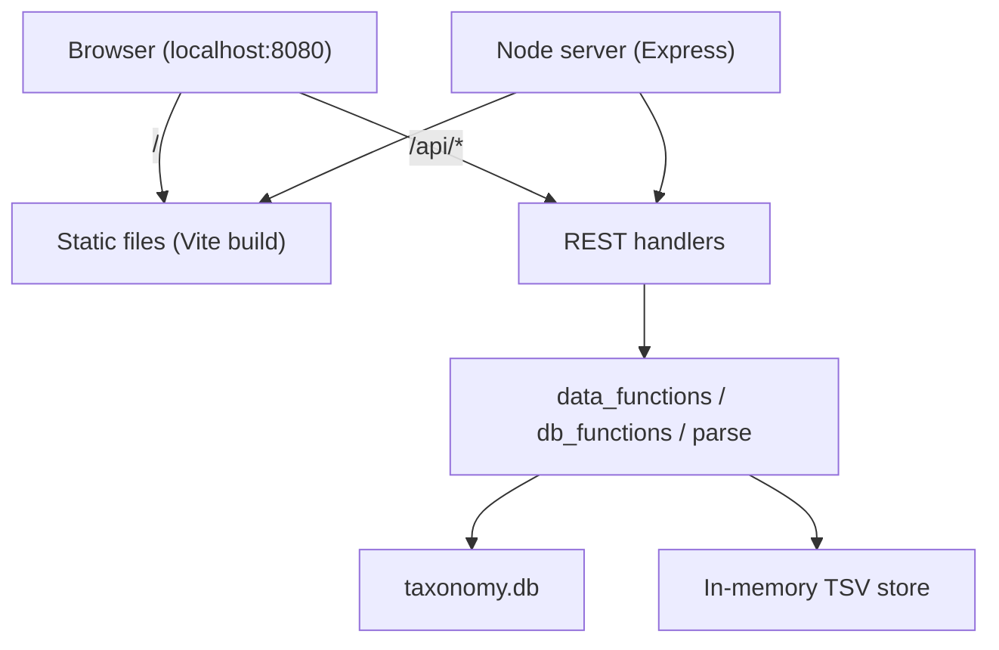

# Electron → Browser + HTTP Backend — Design Spec

> **Status:** Approved (2026-06-08)  
> **Goal:** Remove Electron dependency; ship as a browser-based frontend with a REST API backend in a local Docker container.

## 1. Context

Metapro Viz is currently a three-process Electron app (`electron-vite`):

| Process | Path | Responsibility |
|---|---|---|
| Main (Node) | `src/main/` | TSV parsing, in-memory data store, SQLite lookups, aggregation |
| Preload | `src/preload/` | Exposes `window.electron` IPC bridge |
| Renderer (React 19) | `src/renderer/src/` | Zustand store, d3/Plotly visualizations |

The renderer communicates with the main process via 9 typed IPC channels (`request-*` / `response-*`) with an envelope `{ ok: true, value } | { ok: false, error }`.

**Key insight:** `src/main/data_functions.ts`, `db_functions.ts`, `parse.ts`, and `utils.ts` contain no Electron imports. The migration is a **transport and packaging swap**, not a business-logic rewrite.

## 2. Requirements (Locked In)

| Decision | Choice | Rationale |
|---|---|---|
| Deployment model | Single-user, local Docker container | Users run `docker run -p 8080:8080`; not multi-tenant hosted |
| File intake | Browser upload only | Users may analyze files outside MetaPro output; no server-side file browser |
| Long operations | Synchronous HTTP (option A) | Same compute path as today; `isLoading` spinner unchanged |
| Client timeout | None in v1 | Matches current IPC behavior (wait indefinitely for response) |
| Auth | None | Local `localhost` use only |
| Architecture | Monolith container | One Node process serves static frontend + REST API |
| State management | Module-level globals (`let data`, `let ec`) | Acceptable for one user per container; PR6 `createDataContext()` deferred |

## 3. Migration Approach

**Strangler → monolith container** (incremental, recommended over big-bang or split containers).

### Phases

1. **HTTP server** — Express wraps existing handlers; testable via `curl`
2. **API client** — Replace `ipc.ts` with `fetch`-based `api.ts`
3. **Vite-only frontend** — Remove Electron renderer tooling
4. **Dockerfile** — Multi-stage build, bake `taxonomy.db`
5. **Remove Electron** — Delete deps, preload, `electron-builder` config

Each phase is independently testable. Electron remains functional until phase 5.

## 4. Architecture



### Production

Express serves `dist/` for `/` and mounts `/api/*` routes on a single port (default `8080`).

### Development

- Vite dev server on `:5173` with proxy to API on `:3001`
- `npm run dev` runs both concurrently

## 5. API Contract

### Envelope

Same shape as current IPC, carried in JSON response body:

```ts
type ApiEnvelope<T> = { ok: true; value: T } | { ok: false; error: string }
```

Handler throws → `{ ok: false, error: message }`. HTTP status **200** for all envelope responses (minimizes frontend churn; client checks `ok` field). Server logs errors regardless.

### Endpoint Mapping

| IPC channel | HTTP endpoint | Method | Request | Response `value` |
|---|---|---|---|---|
| `handshake` | `/api/health` | `GET` | — | `0` ok / `3` DB missing |
| `load` | `/api/data` | `POST` | `multipart/form-data`: `name` (string), `file` (TSV) | loaded `name` |
| `load_test` | `/api/data/test` | `POST` | — | `string[]` fixture names |
| `overview` | `/api/viz/overview` | `POST` | `{ names }` | `{ counts_data, ann_data }` |
| `counts` | `/api/viz/counts` | `POST` | `{ names, tax_rank, selected_taxon, selected_ann_cat }` | count vector |
| `krona` | `/api/viz/krona` | `POST` | `{ names, tax_rank, selected_taxon }` | taxonomy tree |
| `chord` | `/api/viz/chord` | `POST` | `{ names, tax_level, ann_level, selected_ann_cat, selected_taxon }` | chord matrix bundle |
| `network` | `/api/viz/network` | `POST` | `{ names, tax_level, selected_taxon, pathway_name, width, height }` | `{ nodes, edges, colors }` |
| `pathway_list` | `/api/viz/pathway-list` | `POST` | `{ superpathway }` | `string[]` |

### Dev-only endpoints

`POST /api/data/test` returns **404** when `NODE_ENV === 'production'`.

## 6. Frontend Changes

| File | Change |
|---|---|
| `src/renderer/src/ipc.ts` | Replace with `api.ts`: `fetch`-based async `request()` |
| `src/renderer/src/App.tsx` | Remove `ipcRenderer.on` listeners; `request()` awaits and routes to `channel_handlers` |
| `src/renderer/src/components/Upload.tsx` | `FormData` multipart upload instead of `FileReader` → IPC string |
| `src/renderer/src/components/*.tsx` | Call sites use `await request(...)` or `.then()` |
| `src/preload/` | Delete entirely |
| `window.electron` references | Remove from all renderer code |

### `request()` behavior

- Sets `isLoading: true` on send (unless `{ silent: true }`)
- Awaits `fetch` response, parses envelope
- On `ok: false` → sets `last_error`
- On `ok: true` → routes `value` to per-channel handler
- Always clears `isLoading` in `finally`
- **No `AbortController` or timeout** in v1

## 7. Backend / Server

### New structure

```
src/server/
  index.ts          # Express entry: routes, static serve, error wrapper
  data_functions.ts # moved from src/main/
  db_functions.ts   # moved from src/main/
  parse.ts          # moved from src/main/
  utils.ts          # moved from src/main/
```

### Server responsibilities

- Register routes mirroring the IPC handler registry in `src/main/index.ts`
- Wrap each handler in try/catch → envelope (same as current IPC wiring)
- Serve `dist/` static files (production)
- Configure CORS for dev (`localhost:5173` → `:3001`); same-origin in prod

### Configuration

| Env var | Default | Purpose |
|---|---|---|
| `PORT` | `8080` | Server listen port |
| `TAXONOMY_DB_PATH` | `resources/db/taxonomy.db` | SQLite database location |
| `NODE_ENV` | — | Gates `load_test` endpoint |

### Upload handling

Use `multer` with memory storage. On `POST /api/data`:
1. Extract `name` and `file` from multipart form
2. Read file buffer as UTF-8 string
3. Call existing `add_data({ name, data })`

### Deleted

- `src/main/index.ts` (Electron window lifecycle + IPC wiring)
- `src/preload/` (context bridge)
- All Electron dependencies (`electron`, `electron-vite`, `electron-builder`, `electron-updater`, `@electron-toolkit/*`)

## 8. Build & Scripts

### Target `package.json` scripts

```bash
dev:api      # tsx watch src/server/index.ts
dev:web      # vite (renderer)
dev          # concurrently dev:api + dev:web
build:web    # vite build → dist/
build:api    # tsc for server
build        # build:web && build:api
start        # node out/server/index.js
test         # vitest run (unchanged)
```

### Build tooling

- **Frontend:** Plain Vite + `@vitejs/plugin-react` (migrate config from `electron.vite.config.ts` renderer section)
- **Backend:** `tsc` with `tsconfig.node.json` (or new `tsconfig.server.json`)
- **Remove:** `electron.vite.config.ts`, `electron-builder.yml`, `dev-app-update.yml`

## 9. Docker

### Dockerfile (multi-stage)

**Build stage:**
- `node:22` base
- `npm ci` → `npm run build`

**Runtime stage:**
- `node:22-slim`
- Copy `out/server/`, `dist/`, `resources/db/taxonomy.db`
- `EXPOSE 8080`
- `CMD ["node", "out/server/index.js"]`

### Usage

```bash
docker build -t metapro-viz .
docker run -p 8080:8080 metapro-viz
# Open http://localhost:8080
```

### Release model

`docker build` + `docker push` with version tags replaces `electron-builder` artifacts (`.dmg`, `.exe`, `.AppImage`). Users pull new images instead of auto-update.

## 10. Error Handling

Identical semantics to current IPC:

| Scenario | Behavior |
|---|---|
| Handler throws | `{ ok: false, error: message }`, logged server-side |
| Malformed response | `last_error: "${channel}: malformed response"` |
| DB unreachable (`handshake` returns 3) | `db_ready: false` + error banner |
| Hung request | Spinner indefinitely (same as lost IPC reply today) |

## 11. Testing

| Layer | Plan |
|---|---|
| Existing Vitest unit/integration tests | Unchanged — import `data_functions` directly |
| New API integration tests | Optional phase 2 — Supertest against Express routes |
| CI (`.github/workflows/test.yml`) | Keep `npm test`; add Docker build smoke test later |

## 12. Performance Expectations

| Factor | Electron (today) | HTTP (target) |
|---|---|---|
| Compute (`parse_ec_chord`, etc.) | Same Node functions | Same — **effectively identical** |
| Transport overhead | In-process IPC | `localhost` HTTP + JSON — negligible |
| UI responsiveness | Main process blocks | Browser UI thread free during `fetch` — **slightly better** |
| Docker overhead | N/A | Minor; negligible for 20–30s jobs |

Single-threaded synchronous handlers remain the bottleneck (acceptable for single-user local use).

## 13. Risks & Mitigations

| Risk | Impact | Mitigation |
|---|---|---|
| Large upload payloads | Memory pressure | `multer` memory limit; document max file size |
| Large JSON responses (chord) | Serialization time | Monitor; add compression later if needed |
| DB not in Docker image | App unusable | Bake `taxonomy.db` at image build time |
| Dev ergonomics without Electron HMR | Slower iteration | Vite proxy from day one |
| Dual tooling during strangler | Confusion | Time-box; delete Electron in final phase |
| `danfojs-node` in container | Image size / ARM compat | Verify in Docker build CI |
| `node:sqlite` | Requires Node 20+ | Pin Node 22 in Dockerfile |

## 14. Out of Scope (v1)

- Client-side `fetch` timeouts / `AbortController`
- Async job queue with polling or SSE
- Volume-mount file browser or server-side file listing
- Authentication or multi-user session isolation
- `createDataContext()` refactor (SPEC PR6)
- `Graph.tsx` migration (pre-existing; separate task)
- nginx reverse proxy
- Split frontend/API containers

## 15. Success Criteria

1. User runs `docker run -p 8080:8080 metapro-viz` and opens browser to `localhost:8080`
2. All 5 mounted visualizations work (Upload, Overview, Krona, Chord, Network)
3. Browser file upload loads TSV data and drives visualizations
4. Delta mode (two files) works as today
5. `npm test` passes without Electron
6. No Electron dependencies remain in `package.json`
7. Existing test fixtures and `taxonomy.db` integration tests pass
