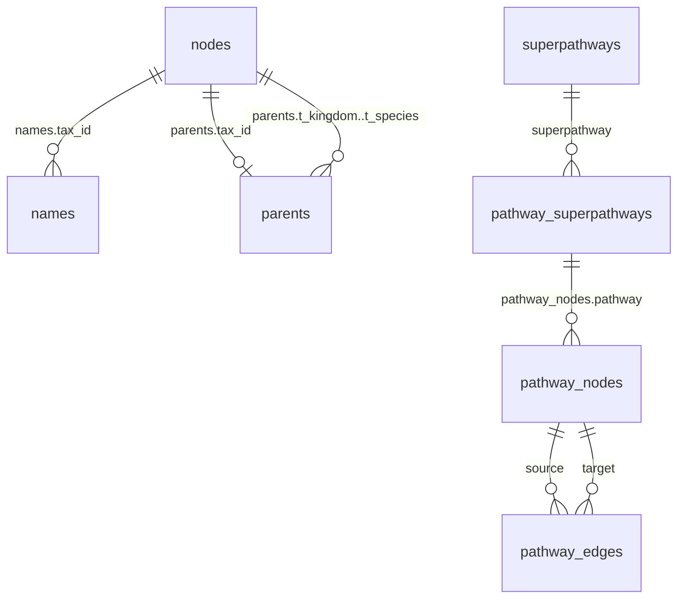
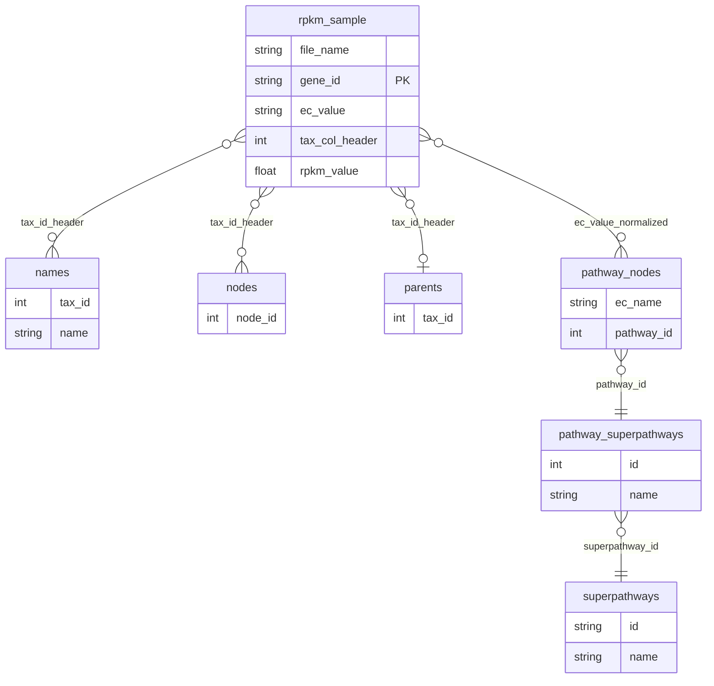

# Exploratory Data Analysis — Design Spec

> **Status:** Approved (2026-06-11)  
> **Goal:** Validate assumptions about MetaPro RPKM sample data and the taxonomy/pathway reference database through reproducible, SQL-first exploratory analysis; document findings and data semantics to support future `analytics/transform/` work (dbt + DuckDB, out of scope here).

## 1. Context

Metapro Viz ingests RPKM TSV output from [MetaPro](https://github.com/ParkinsonLab/MetaPro) and joins it to `resources/db/taxonomy.db` for visualizations. The reference DB is built via ad-hoc Jupyter notebooks under `resources/scripts/`; there is no reproducible Python environment or scripted data-quality pipeline.

**Datasets in scope:**

| Asset | Location | Role |
|---|---|---|
| Sample RPKM 1 | `resources/example_data/test_rpkm_1.tsv` (~51 MB, ~426K rows) | Metagenomic sample; EC + tax_id columns |
| Sample RPKM 2 | `resources/example_data/test_rpkm_2.tsv` (~71 MB, ~461K rows) | Second sample for overlap/diff profiling |
| Reference DB | `resources/db/taxonomy.db` (~793 MB) | NCBI taxonomy + KEGG pathway reference |

**Reference DB tables (7):**

| Table | ~Rows | Purpose |
|---|---|---|
| `nodes` | 2.8M | Tax_id registry |
| `names` | 2.8M | Name ↔ tax_id (many names per tax_id expected) |
| `parents` | 2.8M | Denormalized rank columns per tax_id |
| `pathway_nodes` | 24K | KEGG map nodes (EC numbers as `name`) |
| `pathway_edges` | 47K | Pathway graph edges |
| `pathway_superpathways` | 193 | Pathway → superpathway membership |
| `superpathways` | 13 | Superpathway names |

**RPKM TSV shape:** Fixed columns `GeneID, Length, Reads, EC#, RPKM, Unclassified` plus integer tax_id column headers holding per-taxon values. EC normalization at parse time: `EC:1.1.1.1` → `1.1.1.1`; `None`/empty → `0.0.0.0` (per `SPEC.md`).

## 2. Requirements (Locked In)

| Decision | Choice | Rationale |
|---|---|---|
| Analysis style | **SQL-first via DuckDB + JupySQL** | Declarative over imperative; `%%sql` cells for syntax highlighting |
| Analysis code location | **Jupyter notebook** | Colocation and interactivity; code lives in cells |
| Dev testing | **CLI snippets** (`uv run python -c "..."`) before integrating into notebook | Validate logic in isolation |
| Validation | **Full notebook execute** at end; iterate on code cells only | Reproducible outputs |
| Result immutability | **Never hand-edit notebook `outputs` or fabricate stats** | Outputs regenerated only by execution |
| Dump production | **Outside notebook** (`export_parquet.py`) | Same dump files → same notebook output |
| Parquet versioning | **Git LFS** for all 7 table Parquet files | Version-control reference data content |
| RPKM versioning | **Git LFS** for `test_rpkm_1.tsv` and `test_rpkm_2.tsv` | Reproducible inputs |
| Repo layout | `analytics/exploration/` (now) vs `analytics/transform/` (future) | Clear lifecycle separation |
| Python env | `uv` + `analytics/pyproject.toml` + `analytics/uv.lock` | Lockfile scoped to analytics, not Node app |
| Python version | **3.14** | DuckDB has production `cp314` wheels; dbt deferred to transform phase |
| JSON sidecars | **Deferred** | Notebook outputs are canonical; add `output/` when transform needs machine-readable artifacts |
| Work isolation | **Git worktree** `.worktrees/exploration-eda/` on branch `exploration/eda` | Isolated from main development |
| Scope | **Core + RPKM profiling + reference integrity + cross-domain joins** | Full assumption validation (option C) |

## 3. Repository Layout

```
analytics/
├── pyproject.toml              # uv project, Python 3.14
├── uv.lock
└── exploration/
    ├── scripts/
    │   └── export_parquet.py   # prerequisite: SQLite → Parquet
    ├── notebooks/
    │   └── exploratory_analysis.ipynb
    ├── docs/
    │   └── data-model.md       # data dictionary + semantics (updated from notebook findings)
    └── README.md               # two-step workflow, immutability rules

resources/
├── db/
│   └── parquet/                # Git LFS — one file per table
│       ├── names.parquet
│       ├── nodes.parquet
│       ├── parents.parquet
│       ├── pathway_nodes.parquet
│       ├── pathway_edges.parquet
│       ├── pathway_superpathways.parquet
│       └── superpathways.parquet
└── example_data/
    ├── test_rpkm_1.tsv         # Git LFS
    └── test_rpkm_2.tsv         # Git LFS
```

`.gitattributes` tracks `*.parquet` and `resources/example_data/test_rpkm_*.tsv` via LFS. `.gitignore` is updated to allow these paths through the existing `resources/*` blanket ignore.

## 4. Two-Step Workflow

Analysis depends on pre-produced dump files. The notebook never writes Parquet.

```bash
# Step 1 — produce dumps (run when taxonomy.db changes)
cd analytics
uv run python exploration/scripts/export_parquet.py

# Step 2 — run analysis (reads dumps + RPKM TSVs only)
uv run jupyter execute exploration/notebooks/exploratory_analysis.ipynb
```

**Reproducibility contract:** Given identical `resources/db/parquet/*.parquet` and `resources/example_data/test_rpkm_*.tsv`, notebook execution produces equivalent results.

## 5. Infrastructure Script: `export_parquet.py`

DuckDB attaches SQLite and exports each table:

```sql
ATTACH 'resources/db/taxonomy.db' AS db (TYPE SQLITE);
COPY db.names TO 'resources/db/parquet/names.parquet' (FORMAT PARQUET);
-- repeat for all 7 tables
```

**Behavior:**
- Idempotent — overwrites existing Parquet files
- Prints row count and file size per table
- Exits non-zero if `taxonomy.db` is missing
- Runnable standalone; not invoked from notebook export logic (notebook only verifies outputs exist)

## 6. Python Environment

**Dependencies (exploration only):**
- `duckdb` — SQL engine, Parquet/TSV I/O, SQLite attach
- `jupysql` — `%%sql` cells with SQL syntax highlighting (native DuckDB connection)
- `jupyter`, `ipykernel` — notebook execution

**Not included:** `pandas`, `pyarrow`, `duckdb-engine`, `dbt-core`, `dbt-duckdb`

**Setup:**
```bash
cd analytics && uv sync
```

`.python-version` at repo root (3.14) remains the team-wide Python pin.

## 7. Notebook Structure

Single notebook: `analytics/exploration/notebooks/exploratory_analysis.ipynb`

| Section | Content |
|---|---|
| **1. Setup** | Python cell: `duckdb.connect()`, `%load_ext sql`, `%sql conn`; path constants; shared SQL snippets (e.g. `ec_normalize` as `CASE`) |
| **2. Verify inputs** | Assert Parquet + RPKM files exist; print row counts and file sizes; fail fast with pointer to `export_parquet.py` |
| **3. Data dictionary** | Schema, row counts, PK/FK relationships per table; entity-relationship narrative |
| **4. Cardinality & degrees** | min/max/median stats: names per tax_id, pathway in/out-degree, edges per pathway, etc. |
| **5. RPKM profiling** | Per-file row counts, null/sentinel rates, EC distribution, tax column sparsity, overlap/diff between files |
| **6. Reference integrity** | Orphan FKs, duplicate/ambiguous keys, rank hierarchy consistency, pathway graph connectivity |
| **7. Cross-domain joins** | RPKM tax columns → `names`; EC → `pathway_nodes` → superpathway chain; match rates + unmapped ID lists |
| **8. Findings summary** | Markdown cells summarizing validated assumptions, violations, and gotchas for future analytics |

**Display:** Analysis sections use `%%sql` cells (JupySQL). Setup and dynamic path logic stay in Python cells. CLI snippet testing during development uses `conn.sql("...")` before promoting SQL into `%%sql` cells.

### 7.1 Reference Integrity Checks

| Check | SQL approach | Output |
|---|---|---|
| Orphan FKs | `LEFT JOIN` child → parent `WHERE parent.id IS NULL` | Count + % per FK + sample IDs |
| Duplicate keys | `GROUP BY` key `HAVING COUNT(*) > 1` | Keys with unexpected multiplicity |
| Names per tax_id | `GROUP BY tax_id` cardinality stats | min/max/median (synonyms expected) |
| EC name uniqueness | `GROUP BY name` on `pathway_nodes` | Duplicates affecting `get_superpathway_info()` |
| Rank completeness | `CASE` ladder: if `t_genus` set, expect upstream ranks set | % incomplete rows |
| Rank transitive consistency | Self-join `parents` on rank columns | Mismatched denormalized snapshots |
| Pathway dangling nodes | Nodes with zero edges in pathway | Count per pathway |
| Pathway degree distribution | `GROUP BY` source/target on edges | min/max/median in/out-degree |
| Disconnected components | Per-pathway subgraph analysis | Component count (noting limitations in pure SQL) |

### 7.2 Cross-Domain Join Checks

| Check | SQL approach |
|---|---|
| RPKM tax columns → `names` | `UNPIVOT` tax columns; join to `names` on tax_id |
| RPKM EC → `pathway_nodes` | Normalize EC via `CASE`; join on `pathway_nodes.name` |
| EC → superpathway chain | Join through `pathway_superpathways` → `superpathways` |
| File overlap | Compare distinct tax_ids and ECs across both RPKM files |

## 8. Development Workflow & Immutability

**During development (agent or human):**
1. Write and test SQL/logic via `uv run python -c "..."` or throwaway temp files (not committed)
2. Integrate validated code into notebook cells
3. Execute full notebook
4. Review outputs; iterate on **code cells only**
5. Commit notebook with fresh outputs

**Rules:**
- Never hand-edit `outputs` blocks in `.ipynb` JSON
- Never fabricate statistics in markdown cells
- Parquet files change only via `export_parquet.py`
- `docs/data-model.md` factual claims must match notebook results

## 9. Git LFS Configuration

**`.gitattributes`:**
```
*.parquet filter=lfs diff=lfs merge=lfs -text
resources/example_data/test_rpkm_*.tsv filter=lfs diff=lfs merge=lfs -text
```

**`.gitignore` updates:** Negation rules to allow `resources/db/parquet/`, `test_rpkm_*.tsv`, and `analytics/` through existing `resources/*` ignore patterns.

## 10. Worktree Setup

All exploration work happens on branch `exploration/eda` in worktree `.worktrees/exploration-eda/`.

- `.worktrees/` added to `.gitignore` (project-local worktrees directory)
- First commit on this branch: this design spec (+ `.gitignore` update)
- Implementation commits follow on same branch

## 11. Documentation Deliverables

| Artifact | Purpose |
|---|---|
| `exploratory_analysis.ipynb` (executed) | Canonical analysis report with stored outputs |
| `docs/data-model.md` | Data dictionary plus **as-found** relationships after EDA; discrepancies vs logical model flagged for review |
| `exploration/README.md` | How to set up env, run dumps, execute notebook, dev workflow rules |

## 12. Out of Scope

- dbt models or `analytics/transform/` pipeline
- Statistical modeling or visualization app changes
- Rebuilding `taxonomy.db` from source notebooks
- JSON sidecar output files
- Biological correctness validation (taxonomic accuracy)
- CI integration (may be added later)

## 13. Future Considerations

- **`analytics/transform/`:** Add dbt + dbt-duckdb when dbt-core 1.12 stable supports Python 3.14 and dbt-duckdb follows
- **JSON sidecars:** Add `analytics/exploration/output/` when transform pipeline needs programmatic artifacts
- **uv workspace:** Promote to root workspace if multiple Python packages emerge under `analytics/`

## 14. Entity Relationships (Logical, Pre-Validation)

This diagram states **how we expect** reference tables and RPKM sample files to relate — based on schema DDL, app join logic (`SPEC.md`, `db_functions.ts`), and MetaPro output conventions. Cardinalities shown are **assumed**, not measured. Section 7 EDA validates each edge; `docs/data-model.md` is updated with **as-found** facts afterward.

**Discrepancy handling:** When observed relationships differ from this diagram (orphan rate, missing join keys, unexpected cardinality, undeclared FKs), EDA documents the gap. Whether a discrepancy is a **problem** is decided case-by-case after review — some gaps may be acceptable (e.g. unknown tax_ids left as raw IDs in the viz app).

### 14.1 Reference tables (internal)



Solid lines: declared SQLite FKs where present. `pathway_nodes.pathway → pathway_superpathways.id` is **logical only** (used in app SQL, not declared as FK).

### 14.2 RPKM sample files → reference tables (cross-domain)

Both `test_rpkm_1.tsv` and `test_rpkm_2.tsv` share the same schema; edges below apply to each file independently (overlap/diff validated in section 7.2).



Attribute and join-key detail lives in the table below — kept out of diagram labels so Mermaid parsers do not choke on `=`, `#`, or parentheses.

**Join keys EDA must validate:**

| Edge | Join key | Normalization |
|---|---|---|
| RPKM → `names` | Column header integer → `names.tax_id` | Headers are raw tax_ids |
| RPKM → `nodes` | Column header → `nodes.id` | Same tax_id set as above |
| RPKM → `parents` | Column header → `parents.tax_id` | Subset of tax_ids with hierarchy rows |
| RPKM → `pathway_nodes` | `EC#` → `pathway_nodes.name` | `EC:x.y.z` → `x.y.z`; `None`/empty → `0.0.0.0` |
| EC → superpathway chain | `pathway_nodes` → `pathway_superpathways` → `superpathways` | Matches `get_superpathway_info()` |

**Not modeled as FK edges:** `GeneID`, `Length`, `Reads`, `RPKM`, `Unclassified` are row-level attributes with no reference table in scope.

## 15. Success Criteria

- [ ] `uv sync` installs exploration dependencies reproducibly
- [ ] `export_parquet.py` produces 7 Parquet files matching SQLite row counts
- [ ] Parquet and RPKM files tracked via Git LFS
- [ ] Notebook executes end-to-end reading only dump files + RPKM TSVs
- [ ] All section C analyses produce stored outputs
- [ ] `docs/data-model.md` documents schemas, as-found relationships, and discrepancies vs logical model
- [ ] No hand-edited notebook outputs in committed artifacts
