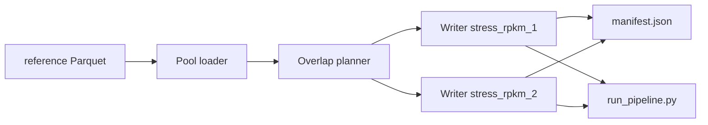

# Stress RPKM Generator — Design Spec

> **Status:** Approved (2026-06-28)  
> **Goal:** A local generator that produces two large, dense, pathway-valid wide RPKM TSVs for stress-testing the dbt transform pipeline and chord/API layer — separate from the hand-crafted `fake_rpkm` golden fixture.

**Parent / related specs:**

- `analytics/exploration/docs/data-model.md` — wide-TSV schema, sparsity, EC normalization, kingdom taxonomy
- `docs/superpowers/specs/2026-06-22-chord-golden-tests-design.md` — minimal `fake_rpkm.tsv` for correctness goldens (not reused for stress data)
- `docs/superpowers/specs/2026-06-15-rpkm-transform-design.md` — pipeline semantics (`stg_rpkm_long`, bridges)

**Work isolation:** Branch `feature/chord-dbt-api` in worktree `.worktrees/chord-dbt-api/`.

## 1. Context

Real sample files (`test_rpkm_1.tsv`, `test_rpkm_2.tsv`) are ~426–461k rows with 8–12 tax columns and **1.74%** nonzero tax cells. Stress-testing the DuckDB/dbt pipeline and API at scale requires a synthetic dataset that is:

- Row-count comparable to real samples
- Much wider (**100** species-ranked tax columns)
- Configurably **dense** (most cells > 0)
- Composed only of **pathway-mapped** EC numbers (no `0.0.0.0`)
- EC-diverse (uses as many distinct reference ECs as possible)

The existing `fake_rpkm` infra (`fake_rpkm_fixture.py`, `run_pipeline.py`) is suitable for **orchestration** after generation but not for **data synthesis** — golden TSV design is hand-picked edge cases with unit values and YAML expectations.

### Reference constraints (from exploration)

| Constraint | Value |
|---|---|
| Pathway-mapped EC pool | **3,867** distinct 4-segment ECs in `pathway_nodes` |
| Species pool (8 kingdoms) | **430,370** species-ranked taxa |
| `test_rpkm_1` rows / tax cols | 425,828 / 8 |
| `test_rpkm_2` rows / tax cols | 461,112 / 12 |
| Real column overlap | 6 shared (75% of file 1, 50% of file 2) |
| Real row overlap (GeneID) | 199,868 shared (~47% of file 1) |
| Pipeline nonzero filter | `stg_rpkm_long` keeps only `value > 0` |

At density 0.95 with 100 columns, each file produces ~**40M** long rows after UNPIVOT (vs ~59k for sparse `test_rpkm_1`). Estimated TSV size: **350–500 MB** per file.

## 2. Requirements (Locked In)

| Decision | Choice | Rationale |
|---|---|---|
| Delivery | **Generator script only**; TSVs gitignored | ~400 MB files unsuitable for git |
| Sample count | **Two files** (`stress_rpkm_1`, `stress_rpkm_2`) | Mirrors `test_rpkm_1` / `_2` multi-sample workflows |
| Row counts | Default 425,828 / 461,112 | Match real samples |
| Tax columns | Default **100** per file | User requirement |
| Species filter | Species-ranked taxa under 8 kingdoms | App domain constraint |
| Species sampling | **Uniform random** from eligible pool | User choice; kingdom-heavy skew expected |
| Density | **`--density` flag** (default 0.95) | Configurable stress level |
| Column overlap | **`--column-overlap`** (default 0.75) | Mirrors real 6/8 shared columns |
| Row overlap | **`--row-overlap`** (default 0.47) | Mirrors real shared GeneID rate |
| EC policy | Pathway-mapped only; maximize distinct ECs | No unmapped rows; cap = 3,867 ECs |
| Reproducibility | **Random each run** (v1) | `--seed` deferred until cross-machine risks audited |
| Golden tests | **Out of scope** | Stress fixture, not correctness oracle |
| `fake_rpkm` | **Unchanged** | Separate correctness fixture |

## 3. Approach

**Selected: Hybrid — DuckDB pools + Python chunked writer**

| Approach | Verdict |
|---|---|
| Pure DuckDB SQL export | Rejected — two-file overlap logic awkward; `random()` opaque |
| Pure Python writer | Rejected — must duplicate reference queries; slower pool loading |
| **Hybrid** | **Selected** — DuckDB loads sorted pools from Parquet; Python handles overlap, density, streaming TSV write |

## 4. File Layout

```
analytics/
├── transform/
│   └── scripts/
│       └── generate_stress_rpkm.py      # NEW — main generator
└── transform/tests/python/
    └── test_generate_stress_rpkm.py     # NEW — unit + mini-generation tests

resources/example_data/                  # gitignored outputs
├── stress_rpkm_1.tsv
├── stress_rpkm_2.tsv
└── stress_rpkm_manifest.json

.gitignore                               # add stress_rpkm_*.tsv, stress_rpkm_manifest.json
```

**Runtime artifacts (gitignored):**

```
transform/runs/stress_rpkm_1/sample.duckdb
transform/runs/stress_rpkm_2/sample.duckdb
```

### Component responsibilities

| Unit | Responsibility |
|---|---|
| **Pool loader** (DuckDB) | Species-ranked `tax_id`s under 8 kingdoms; all pathway-mapped 4-segment ECs |
| **Overlap planner** (Python) | Partition GeneIDs and tax columns into shared / file-1-only / file-2-only |
| **Row generator** (Python) | Fixed columns + tax-cell matrix; density mask; chunked TSV streaming |
| **Manifest writer** | JSON sidecar with CLI args, pool sizes, checksums, validation metrics |

### Data flow



## 5. CLI

```bash
cd analytics
uv run python transform/scripts/generate_stress_rpkm.py \
  --output-dir ../resources/example_data \
  --rows-1 425828 --rows-2 461112 \
  --tax-cols 100 \
  --density 0.95 \
  --column-overlap 0.75 \
  --row-overlap 0.47
```

| Flag | Default | Meaning |
|---|---|---|
| `--output-dir` | `resources/example_data` | Output directory for TSVs + manifest |
| `--rows-1` / `--rows-2` | `425828` / `461112` | Row counts per file |
| `--tax-cols` | `100` | Species `tax_id` columns per file |
| `--density` | `0.95` | Per-cell probability that parsed value **> 0** |
| `--column-overlap` | `0.75` | Fraction of **file-1** tax columns also in file-2 |
| `--row-overlap` | `0.47` | Fraction of **file-1** `GeneID`s also in file-2 |
| `--raw-parquet-dir` | `resources/db/parquet` | Reference Parquet root (repo-relative from analytics) |
| `--kingdoms` | Built-in 8 kingdom `tax_id`s | Override allowlist if needed |

### Overlap semantics

**Columns** (`tax_cols=100`, `column_overlap=0.75`):

- `n_shared = round(0.75 × 100) = 75` tax columns appear in **both** files (same `tax_id` headers)
- 25 columns unique to file 1; 25 unique to file 2
- Column order: shared (sorted by `tax_id`), then file-specific (sorted)
- Sample `2 × tax_cols - n_shared = 125` distinct species without replacement from pool

**Rows** (`rows_1=425828`, `row_overlap=0.47`):

- `n_shared = round(0.47 × 425828) = 200,139` `GeneID`s in both files
- File-1-only: `225,689`; file-2-only: `260,973`
- Shared genes get **independently** re-randomized tax values per file

## 6. Kingdom Allowlist

Species filter: `parents.t_kingdom IN (...)` AND `parents.t_species = parents.tax_id`.

| Kingdom | `tax_id` | Species-ranked count |
|---|---|---:|
| Bacillati | 1783272 | 186,076 |
| Pseudomonadati | 3379134 | 236,202 |
| Fusobacteriati | 3384189 | 389 |
| Thermotogati | 3384194 | 1,174 |
| Methanobacteriati | 3366610 | 5,894 |
| Nanobdellati | 1783276 | 50 |
| Promethearchaeati | 1935183 | 31 |
| Thermoproteati | 1783275 | 554 |

**Pool query (species):**

```sql
SELECT p.tax_id
FROM parents p
WHERE p.t_kingdom IN (/* kingdom tax_ids */)
  AND p.t_species = p.tax_id
ORDER BY p.tax_id
```

**Pool query (ECs)** — same filter as `build_reference.py` / `bridge_ec_pathway`:

```sql
SELECT DISTINCT n.name AS ec_normalized
FROM pathway_nodes n
WHERE regexp_matches(n.name, '^[0-9]+\.[0-9]+\.[0-9]+\.[0-9]+$')
  AND n.name != '0.0.0.0'
ORDER BY ec_normalized
```

## 7. Row and Cell Generation

### Fixed columns

| Column | Rule |
|---|---|
| `GeneID` | `stress_{file}_{index:08d}` — shared genes use the **same** ID in both files |
| `Length` | Uniform random int 50–2000 |
| `Reads` | Uniform random int 1–50 |
| `EC#` | Pathway-mapped EC only; bare `x.y.z.w` format |
| `RPKM` | Sum of tax-column values for the row (computed after tax cells drawn) |
| `Unclassified` | Always `0.000000` |

### EC assignment (maximize distinct ECs)

1. Load all pathway-mapped ECs; shuffle once per run.
2. First **3,867** rows (in file generation order): each EC used **exactly once**.
3. Remaining rows: round-robin through the shuffled EC list.

When `rows ≥ 3,867`, every file uses **all 3,867** distinct reference ECs. No row may use `0.0.0.0` or an EC absent from `pathway_nodes`.

### Tax column values

- Header = `tax_id` as string (integer column name in wide TSV).
- Per cell: if `random() < density` → `uniform(0.01, 10.0)` formatted `%.6f`; else → `0.000000`.
- Zero cells use `0.000000` (matches real file convention); pipeline filters `value > 0`.

### Performance

- Stream rows in chunks (~1,000 rows); never materialize full matrix in RAM.
- Expect ~2–5 minutes per file at default settings on a laptop.

## 8. Validation and Manifest

### Pre-flight (fail before writing)

- `--raw-parquet-dir` exists with `parents.parquet` and `pathway_nodes.parquet`
- Species pool size ≥ `2 × tax_cols - n_shared`
- EC pool size ≥ 1 (expect 3,867)

### Post-generation checks

| Check | Expected |
|---|---|
| Row count per file | Matches `--rows-1` / `--rows-2` |
| Tax column count | `tax_cols` each |
| Shared column count | `n_shared` |
| Shared row count | `round(row_overlap × rows_1)` |
| Distinct ECs per file | **3,867** when rows ≥ 3,867 |
| Rows with unmapped / missing EC | **0** |
| Observed nonzero cell rate | `density ± 0.01` |
| All tax headers resolve in `parents` | 100% |

### Manifest (`stress_rpkm_manifest.json`)

```json
{
  "generated_at": "2026-06-28T12:00:00Z",
  "cli_args": {
    "rows_1": 425828,
    "rows_2": 461112,
    "tax_cols": 100,
    "density": 0.95,
    "column_overlap": 0.75,
    "row_overlap": 0.47
  },
  "pools": { "species": 430370, "ecs": 3867 },
  "overlap": { "shared_columns": 75, "shared_rows": 200139 },
  "files": [
    {
      "name": "stress_rpkm_1.tsv",
      "rows": 425828,
      "tax_cols": 100,
      "distinct_ecs": 3867,
      "nonzero_rate": 0.949,
      "sha256": "...",
      "bytes": 400000000
    }
  ]
}
```

## 9. Testing

**Generator tests** (fast; no 400 MB fixture committed):

| Test | Asserts |
|---|---|
| `test_overlap_planner` | Column/row partition counts for given overlap % |
| `test_ec_assignment` | All pool ECs used when rows ≥ pool size |
| `test_mini_generation` | `--rows-1 50 --rows-2 60 --tax-cols 10 --density 0.5` → valid shape + post-checks pass |
| `test_tax_headers_resolve` | Mini output headers exist in `parents` |

**Manual stress workflow:**

```bash
# 1. Generate
cd analytics
uv run python transform/scripts/generate_stress_rpkm.py

# 2. Pipeline (each sample)
uv run python transform/scripts/run_pipeline.py \
  --sample-id stress_rpkm_1 \
  --rpkm-path ../resources/example_data/stress_rpkm_1.tsv

# 3. API — load stress_rpkm_1 in dev app or call chord endpoint
```

## 10. Out of Scope (v1)

- Committed full-size TSV fixtures or Git LFS
- Golden YAML / parametrized correctness expectations for stress data
- CI performance benchmarks or regression timing gates
- `--seed` / cross-machine reproducibility (deferred — see §11)
- Changes to `fake_rpkm.tsv`, `fake_rpkm_fixture.py`, or golden tests
- Stratified kingdom sampling (`--species-sample stratified`)

## 11. Deferred: Reproducibility (`--seed`)

v1 uses OS randomness each run. A future `--seed` mode should:

1. Sort all pools before sampling (`tax_id`, EC strings)
2. Use isolated `random.Random(seed)` — no numpy, no DuckDB `random()`
3. Fixed float formatting (`%.6f`)
4. Record seed in manifest

Cross-machine guarantees require auditing Python version sensitivity and documenting pinned runtime. Not in v1.

## 12. Success Criteria

- [ ] `generate_stress_rpkm.py` produces `stress_rpkm_1.tsv` and `stress_rpkm_2.tsv` at default flags
- [ ] Post-generation validation passes; manifest written
- [ ] `run_pipeline.py` completes for both samples
- [ ] Chord API returns a valid matrix for `stress_rpkm_1` at default ranks
- [ ] Generator unit tests pass (mini fixture only)
- [ ] `stress_rpkm_*.tsv` and manifest gitignored
- [ ] `fake_rpkm` golden tests unaffected

## 13. References

- `analytics/transform/scripts/run_pipeline.py`
- `analytics/transform/scripts/build_reference.py` — EC bridge filter
- `analytics/transform/scripts/stg_rpkm_long.py` — UNPIVOT + `value > 0` filter
- `analytics/testing/fake_rpkm_fixture.py` — pipeline orchestration pattern
- `resources/example_data/test_rpkm_1.tsv`, `test_rpkm_2.tsv` — real sample shape
- `analytics/exploration/docs/data-model.md`
